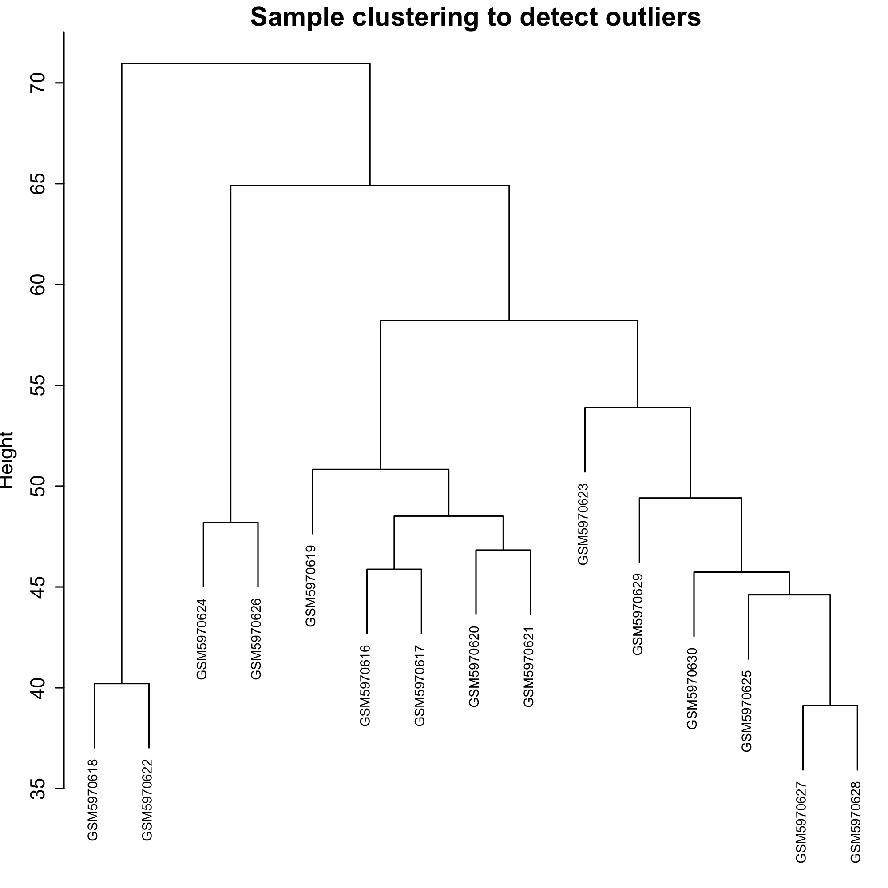
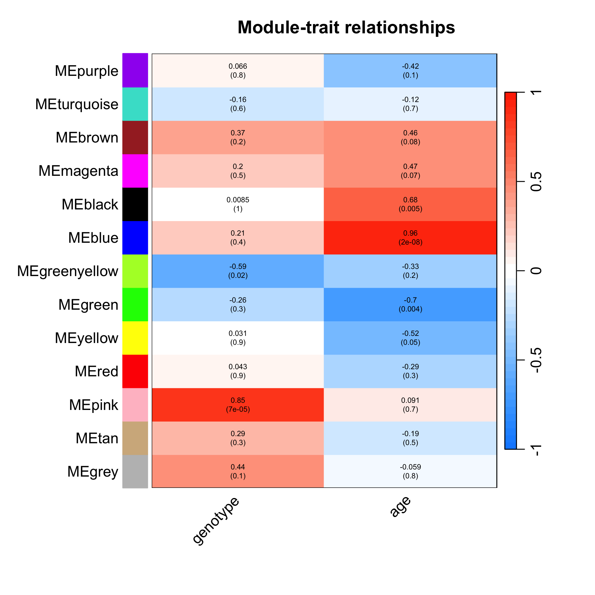
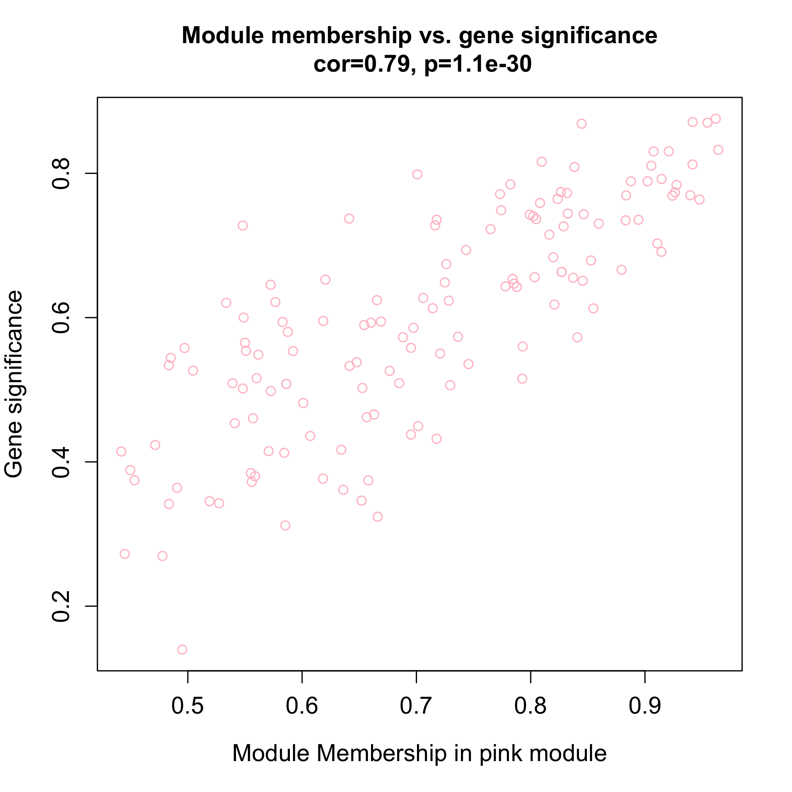
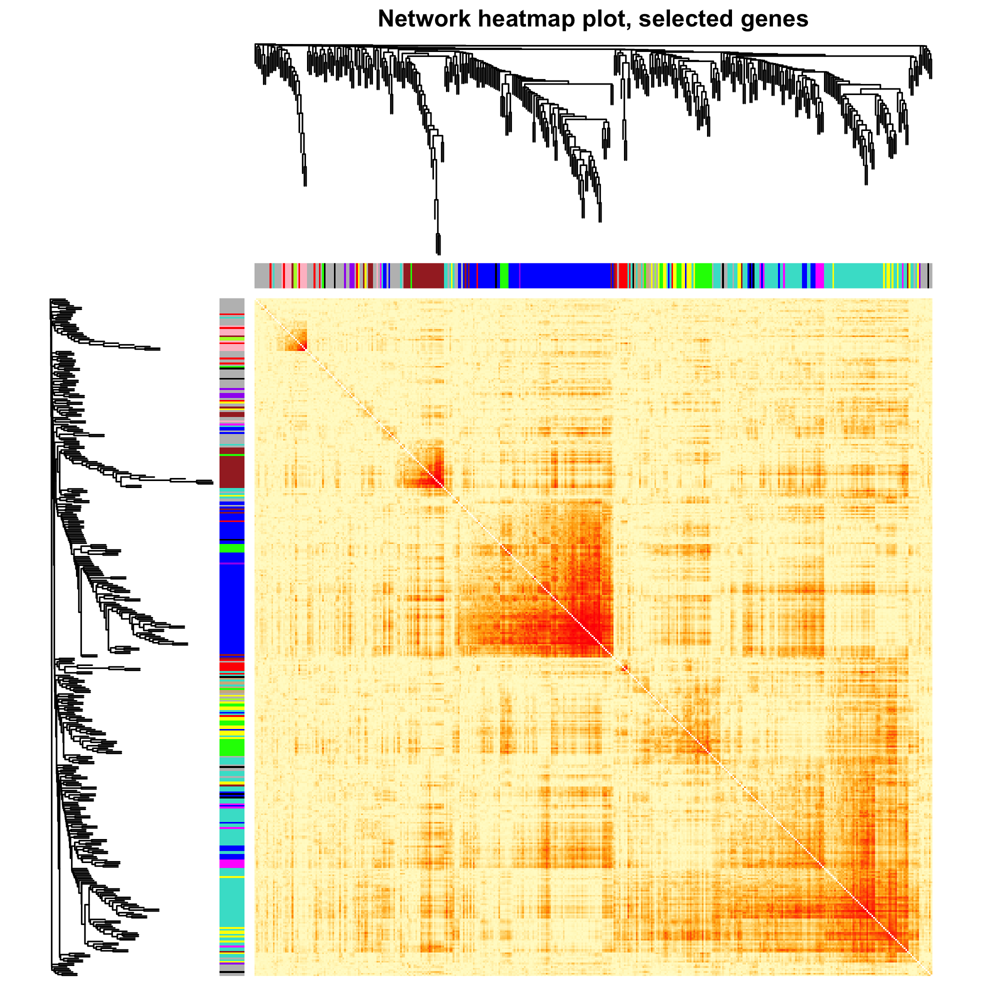

Use tinyarray package to simplify the analysis process and add WGCNA and TOM analysis
```{r}
rm(list = ls())
library(tinyarray)
library(stringr)
library(dplyr)
library(ggplot2)
library(WGCNA)
library(clusterProfiler)
```

```{r}
# get GEOdata
geo = geo_download("GSE199335")
exp = geo$exp

# check abnormal sample
boxplot(exp,las = 2)

# get clinical data
pd = geo$pd
gpl_number = geo$gpl

# extract group data
Group = paste(geo$pd$genotype,geo$pd$age,sep="_") %>% 
  str_remove(" months of age| weeks of age") %>% 
  str_remove(" type") %>% 
  str_replace("/",".")
table(Group)
Group = factor(Group,levels = c("wild_6", "wild_9", "R6.1_6", "R6.2_9"))

# get probe anno
find_anno(gpl_number) 
# ids <- AnnoProbe::idmap('GPL17400') not work, download manually from GEO webset
anno <- read.delim("GPL17400-81842.txt", check.names = F, comment.char = "#")
colnames(anno)
ids = anno[,c("ID", "gene_assignment")]
ids$symbol <- str_split_i(ids$gene_assignment, " // ", 2)
head(ids)
table(is.na(ids$symbol))
ids <- ids[!is.na(ids$symbol),c(1,3)]
colnames(ids) <- c("probe_id", "symbol")
nrow(ids)

```

```{r}
# DE analysis and visualization
dcp = get_deg_all(exp,Group,ids,entriz = F)
table(dcp$deg$change)
head(dcp$deg[[1]]) # DEGs stored as list, first group(wild_6) as control
dcp$plots[[1]] # heatmap
dcp$plots[[2]] # PCA for all 
dcp$plots[[3]] # venn plot for all DEGs
dcp$plots[[4]] # volcanos for all comparisons
dcp$plots # summary plot with legend
```

```{r}
# enrichment analysis
deg = get_deg(exp,Group,ids, species = "mouse")
deg <- deg[[1]] # take subset for 1 comparison
genes = deg$ENTREZID[deg$change!="stable"]
head(genes)

# e = quick_enrich(genes,destdir = tempdir(), species = "mouse") not work, may due to network problems
# names(e)
# e[[1]][1:4,1:4]
# library(patchwork)
# e[[3]]+e[[4]]
# ggsave("enrich.png",width = 12,height = 7) 

# do it manually using clusterprofiler
library(org.Mm.eg.db)
ekk <- enrichKEGG(genes, organism = "mmu")
ekk <- setReadable(ekk, OrgDb = org.Mm.eg.db, keyType = "ENTREZID") 
barplot(ekk)
```

Try WGCNA and TOM analysis
```{r}
# take top 5000 genes by median absolute deviation
datExpr0 = t(exp[order(apply(exp, 1, mad), decreasing = T)[1:5000],])
datExpr0[1:4,1:4]
```
```{r}
# gene filtration 
gsg = goodSamplesGenes(datExpr0, verbose = 3)
gsg$allOK # continue if TRUE
if (!gsg$allOK){
  # print GENEs with NA
  if (sum(!gsg$goodGenes)>0)
    printFlush(paste("Removing genes:", paste(names(datExpr0)[!gsg$goodGenes], collapse = ", ")));
  if (sum(!gsg$goodSamples)>0)
    printFlush(paste("Removing samples:", paste(rownames(datExpr0)[!gsg$goodSamples], collapse = ", ")));
  # remove NA values
  datExpr0 = datExpr0[gsg$goodSamples, gsg$goodGenes]
}
```

```{r}
# sample filtration
sampleTree = hclust(dist(datExpr0), method = "average")

png(file = "2.sampleClustering.png", width = 2000, height = 2000,res = 300)
par(cex = 0.6)
par(mar = c(0,4,2,0))
plot(sampleTree, main = "Sample clustering to detect outliers", sub="", xlab="", cex.lab = 1.5,
     cex.axis = 1.5, cex.main = 2)
dev.off()
```
Check if there are any clusters with only 1 sample


Extract phynotype data
```{r}
traitData = data.frame(genotype = as.numeric(as.factor(pd$genotype)),
                       age = as.numeric(as.factor(pd$age)))
str(traitData)
table(traitData[,1])
names(traitData)
```

```{r}
datTraits = traitData
sampleTree2 = hclust(dist(datExpr0), method = "average")
# red: high, white: low, grey: missing
traitColors = numbers2colors(datTraits, signed = FALSE)
# plot the clustering above and phynotype
png(file = "3.Sample dendrogram and trait heatmap.png", width = 2000, height = 2000,res = 300)
plotDendroAndColors(sampleTree2, traitColors,
                    groupLabels = names(datTraits),
                    main = "Sample dendrogram and trait heatmap")
dev.off()
```


```{r}
# pick soft threshold value for WGCNA
powers = c(1:10, seq(from = 12, to=30, by=2))
sft = pickSoftThreshold(datExpr0, powerVector = powers, verbose = 5)
sft$powerEstimate # recommended soft threshold 6
```

```{r}
cex1 = 0.9 
png(file = "4.Soft threshold.png", width = 2000, height = 1500,res = 300)
par(mfrow = c(1,2))
plot(sft$fitIndices[,1], -sign(sft$fitIndices[,3])*sft$fitIndices[,2],
     xlab="Soft Threshold (power)",
     ylab="Scale Free Topology Model Fit,signed R^2",type="n",
     main = paste("Scale independence"))
text(sft$fitIndices[,1], -sign(sft$fitIndices[,3])*sft$fitIndices[,2],
     labels=powers,cex=cex1,col="red")
abline(h=cex1,col="red")
plot(sft$fitIndices[,1], sft$fitIndices[,5],
     xlab="Soft Threshold (power)",ylab="Mean Connectivity", type="n",
     main = paste("Mean connectivity"))
text(sft$fitIndices[,1], sft$fitIndices[,5], labels=powers, cex=cex1,col="red")
dev.off()
```


```{r}
power = sft$powerEstimate # 18

cor <- WGCNA::cor # reassign this function, otherwise it can be runned but can not be knited

net = WGCNA::blockwiseModules(datExpr0, power = 12, 
                              weights = NULL,
                              cosineCorrelation = FALSE,
                       TOMType = "unsigned", 
                       minModuleSize = 30, 
                       reassignThreshold = 0, 
                       mergeCutHeight = 0.25,
                       deepSplit = 2 ,
                       numericLabels = TRUE,
                       pamRespectsDendro = FALSE,
                       saveTOMs = TRUE,
                       saveTOMFileBase = "testTOM",
                       verbose = 3)

cor <- stats::cor
```

```{r}
# show modules
table(net$colors)
```

```{r}
mergedColors = labels2colors(net$colors)
png(file = "5.DendroAndColors.png", width = 2000, height = 1200,res = 300)
plotDendroAndColors(net$dendrograms[[1]], mergedColors[net$blockGenes[[1]]],
                    "Module colors",
                    dendroLabels = FALSE, hang = 0.03,
                    addGuide = TRUE, guideHang = 0.05)
dev.off()
```


```{r}
# store modules with their genes
moduleLabels = net$colors
moduleColors = labels2colors(net$colors)
MEs = net$MEs
geneTree = net$dendrograms[[1]]
gm = data.frame(net$colors)
gm$color = moduleColors
head(gm)
genes = split(rownames(gm),gm$color)
```

```{r}
# calculate the correlation between phenotypes and modules
nGenes = ncol(datExpr0)
nSamples = nrow(datExpr0)
MEs0 = moduleEigengenes(datExpr0, moduleColors)$eigengenes
MEs = orderMEs(MEs0)
moduleTraitCor = cor(MEs, datTraits, use = "p")
moduleTraitPvalue = corPvalueStudent(moduleTraitCor, nSamples)

# Heatmap
png(file = "6.labeledHeatmap.png", width = 2000, height = 2000,res = 300)

textMatrix = paste(signif(moduleTraitCor, 2), "\n(",
                   signif(moduleTraitPvalue, 1), ")", sep = "")
dim(textMatrix) = dim(moduleTraitCor)
par(mar = c(6, 8.5, 3, 3))

labeledHeatmap(Matrix = moduleTraitCor,
               xLabels = names(datTraits),
               yLabels = names(MEs),
               ySymbols = names(MEs),
               colorLabels = FALSE,
               colors = blueWhiteRed (50),
               textMatrix = textMatrix,
               setStdMargins = FALSE,
               cex.text = 0.5,
               zlim = c(-1,1),
               main = paste("Module-trait relationships"))

dev.off()
```


GS:The correlation between each gene in the module and the trait
MM:The correlation between each gene and the module it belongs to indicates whether it is consistent with the trend of the module.

```{r}
modNames = substring(names(MEs), 3)
geneModuleMembership = as.data.frame(cor(datExpr0, MEs, use = "p"))
MMPvalue = as.data.frame(corPvalueStudent(as.matrix(geneModuleMembership), nSamples))
names(geneModuleMembership) = paste("MM", modNames, sep="")
names(MMPvalue) = paste("p.MM", modNames, sep="")
```

```{r}
i = 1 # column we most interest
module = "pink" # color with highest correlation 
assign(colnames(traitData)[i],traitData[i])
instrait = eval(parse(text = colnames(traitData)[i]))
geneTraitSignificance = as.data.frame(cor(datExpr0, instrait, use = "p"))
GSPvalue = as.data.frame(corPvalueStudent(as.matrix(geneTraitSignificance), nSamples))
names(geneTraitSignificance) = paste("GS.", names(instrait), sep="")
names(GSPvalue) = paste("p.GS.", names(instrait), sep="")
png(file = paste0("7.MM-GS-scatterplot.png"), width = 2000, height = 2000,res = 300)
column = match(module, modNames) 
moduleGenes = moduleColors==module 
par(mfrow = c(1,1))
verboseScatterplot(abs(geneModuleMembership[moduleGenes, column]),
                   abs(geneTraitSignificance[moduleGenes, 1]),
                   xlab = paste("Module Membership in", module, "module"),
                   ylab = "Gene significance",
                   main = paste("Module membership vs. gene significance\n"),
                   cex.main = 1.2, cex.lab = 1.2, cex.axis = 1.2, col = module)
dev.off()
```

Here we want to see strong positive correlation

TOM:
The weighted network is displayed as a gene correlation heat map, with each row and column representing a gene. Strong correlations should be observed in red on the diagonal

```{r}
nSelect = 400
set.seed(10)
dissTOM = 1-TOMsimilarityFromExpr(datExpr0, power = 6)
select = sample(nGenes, size = nSelect)
selectTOM = dissTOM[select, select]

selectTree = hclust(as.dist(selectTOM), method = "average")
selectColors = moduleColors[select]
library(gplots)
myheatcol = colorpanel(250,'red',"orange",'lemonchiffon')
png(file = "8.Sub400-netheatmap.png", width = 2000, height = 2000,res = 300)
plotDiss = selectTOM^7
diag(plotDiss) = NA # diagnal displayed as white dots to show the trend more clearly.
TOMplot(plotDiss, selectTree, selectColors, col=myheatcol,main = "Network heatmap plot, selected genes")
dev.off()
```
