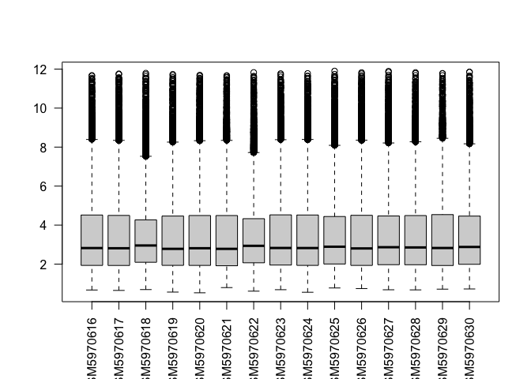
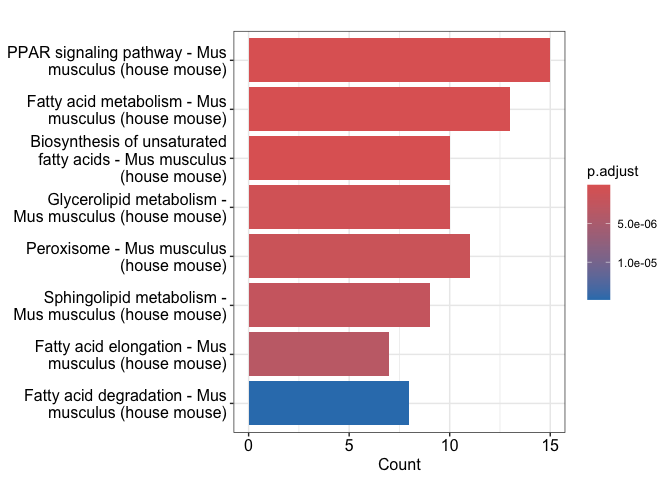
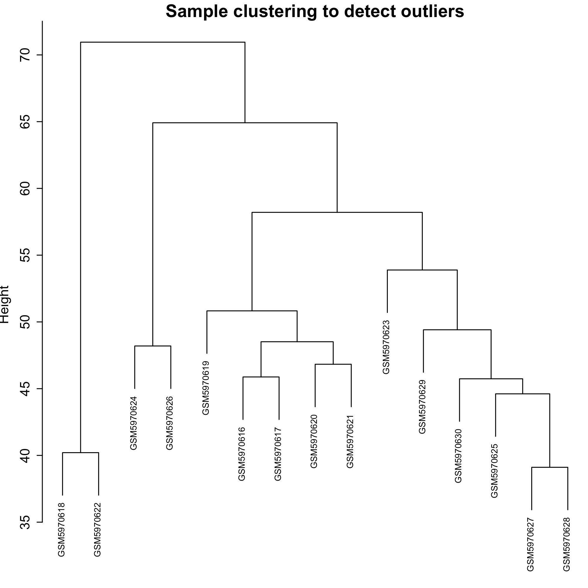
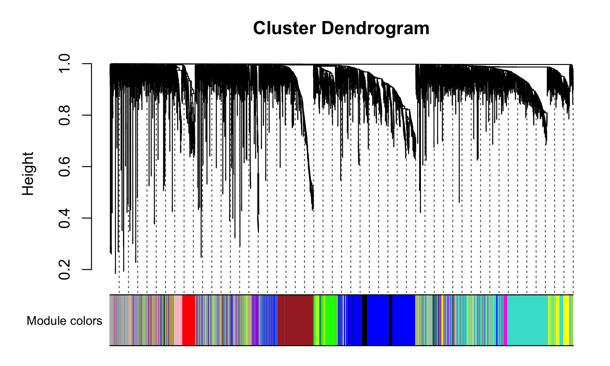
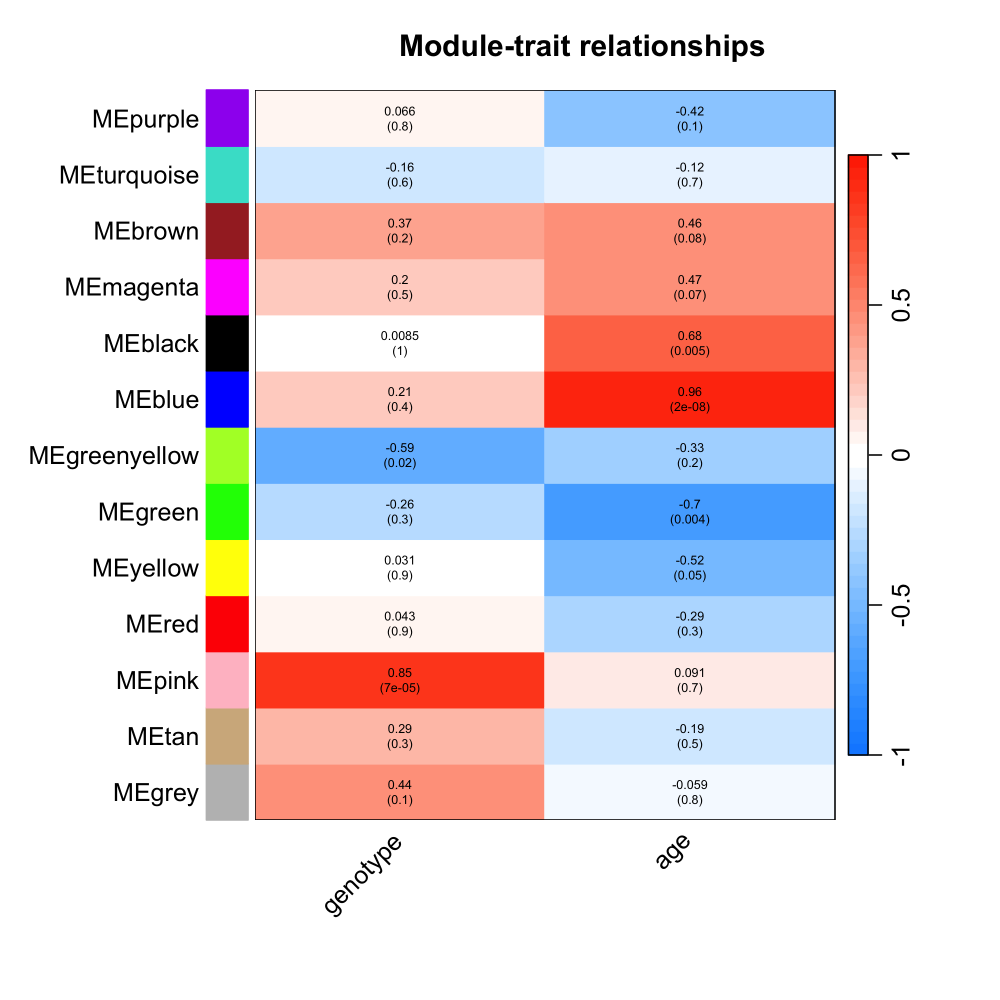
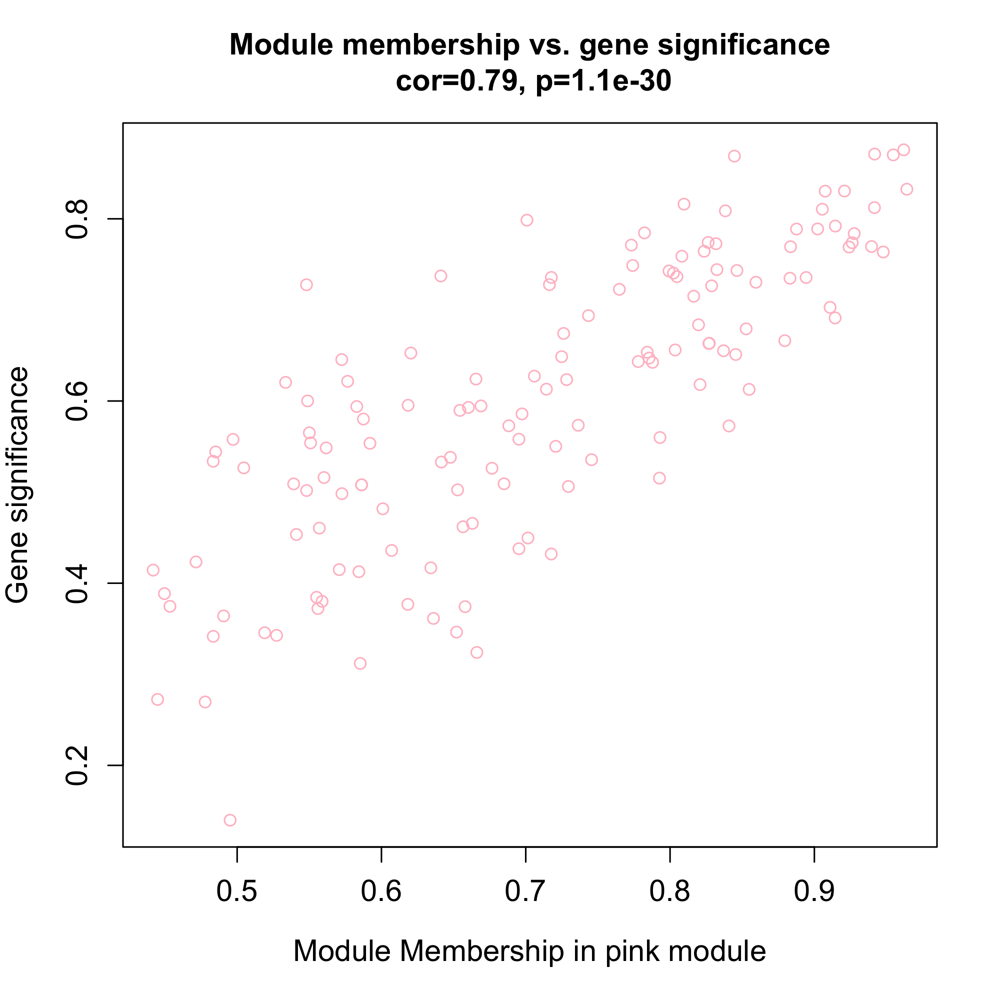
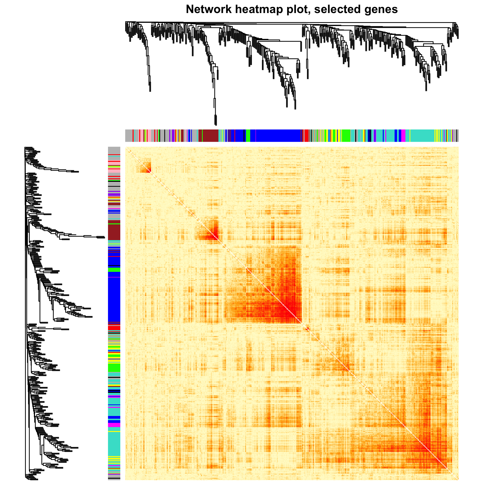

GSE199335
================
Dayou Zou
2024-07-25

Use tinyarray package to simplify the analysis process and add WGCNA and
TOM analysis

``` r
rm(list = ls())
library(tinyarray)
```

    ## 

    ## Registered S3 methods overwritten by 'treeio':
    ##   method              from    
    ##   MRCA.phylo          tidytree
    ##   MRCA.treedata       tidytree
    ##   Nnode.treedata      tidytree
    ##   Ntip.treedata       tidytree
    ##   ancestor.phylo      tidytree
    ##   ancestor.treedata   tidytree
    ##   child.phylo         tidytree
    ##   child.treedata      tidytree
    ##   full_join.phylo     tidytree
    ##   full_join.treedata  tidytree
    ##   groupClade.phylo    tidytree
    ##   groupClade.treedata tidytree
    ##   groupOTU.phylo      tidytree
    ##   groupOTU.treedata   tidytree
    ##   inner_join.phylo    tidytree
    ##   inner_join.treedata tidytree
    ##   is.rooted.treedata  tidytree
    ##   nodeid.phylo        tidytree
    ##   nodeid.treedata     tidytree
    ##   nodelab.phylo       tidytree
    ##   nodelab.treedata    tidytree
    ##   offspring.phylo     tidytree
    ##   offspring.treedata  tidytree
    ##   parent.phylo        tidytree
    ##   parent.treedata     tidytree
    ##   root.treedata       tidytree
    ##   rootnode.phylo      tidytree
    ##   sibling.phylo       tidytree

    ## tinyarray v 2.4.2  welcome to use tinyarray!
    ## If you use tinyarray in published research, please acknowledgements:
    ## We thank Dr.Jianming Zeng(University of Macau), and all the members of his bioinformatics team, biotrainee,especially Xiaojie Sun, for generously sharing their experience and codes.

``` r
library(stringr)
library(dplyr)
```

    ## 
    ## Attaching package: 'dplyr'

    ## The following object is masked from 'package:tinyarray':
    ## 
    ##     union_all

    ## The following objects are masked from 'package:stats':
    ## 
    ##     filter, lag

    ## The following objects are masked from 'package:base':
    ## 
    ##     intersect, setdiff, setequal, union

``` r
library(ggplot2)
library(WGCNA)
```

    ## Loading required package: dynamicTreeCut

    ## Loading required package: fastcluster

    ## 
    ## Attaching package: 'fastcluster'

    ## The following object is masked from 'package:stats':
    ## 
    ##     hclust

    ## 
    ## Attaching package: 'WGCNA'

    ## The following object is masked from 'package:stats':
    ## 
    ##     cor

``` r
library(clusterProfiler)
```

    ## clusterProfiler v4.8.3  For help: https://yulab-smu.top/biomedical-knowledge-mining-book/
    ## 
    ## If you use clusterProfiler in published research, please cite:
    ## T Wu, E Hu, S Xu, M Chen, P Guo, Z Dai, T Feng, L Zhou, W Tang, L Zhan, X Fu, S Liu, X Bo, and G Yu. clusterProfiler 4.0: A universal enrichment tool for interpreting omics data. The Innovation. 2021, 2(3):100141

    ## 
    ## Attaching package: 'clusterProfiler'

    ## The following object is masked from 'package:stats':
    ## 
    ##     filter

``` r
# get GEOdata
geo = geo_download("GSE199335")
```

    ## 41345 probes, 15 samples from 0.527930508 to 11.90085923

``` r
exp = geo$exp

# check abnormal sample
boxplot(exp,las = 2)
```

<!-- -->

``` r
# get clinical data
pd = geo$pd
gpl_number = geo$gpl

# extract group data
Group = paste(geo$pd$genotype,geo$pd$age,sep="_") %>% 
  str_remove(" months of age| weeks of age") %>% 
  str_remove(" type") %>% 
  str_replace("/",".")
table(Group)
```

    ## Group
    ## R6.1_6 R6.2_9 wild_6 wild_9 
    ##      3      4      4      4

``` r
Group = factor(Group,levels = c("wild_6", "wild_9", "R6.1_6", "R6.2_9"))

# get probe anno
find_anno(gpl_number) 
```

    ## no annotation packages avliable,please use `ids <- AnnoProbe::idmap('GPL17400')`

    ## if you get error by this code ,please try different `type` parameters

``` r
# ids <- AnnoProbe::idmap('GPL17400') not work, download manually from GEO webset
anno <- read.delim("GPL17400-81842.txt", check.names = F, comment.char = "#")
colnames(anno)
```

    ##  [1] "ID"              "probeset_id"     "seqname"         "strand"         
    ##  [5] "start"           "stop"            "total_probes"    "gene_assignment"
    ##  [9] "mrna_assignment" "category"        "SPOT_ID"

``` r
ids = anno[,c("ID", "gene_assignment")]
ids$symbol <- str_split_i(ids$gene_assignment, " // ", 2)
head(ids)
```

    ##         ID
    ## 1 17210850
    ## 2 17210852
    ## 3 17210855
    ## 4 17210869
    ## 5 17210883
    ## 6 17210887
    ##                                                                                                                                                                                                                                                                                                                                                                                                                                                                                                                                                                                                                                                                                                                                                                                                                                                                                                                                                                                                                                                                                                                                                                                                                                                                                                    gene_assignment
    ## 1                                                                                                                                                                                                                                                                                                                                                                                                                                                                                                                                                                                                                                                                                                                                                                                                                                                                                                                                                                                                                                                                                                                                                                                                                                                                                                              ---
    ## 2                                                                                                                                                                                                                                                                                                                                                                                                                                                                                                                                                                                                                                                                                                                                                                                                                                                                                                                                                                                                                                                                                                                                                                                                                                                                                                              ---
    ## 3 NM_008866 // Lypla1 // lysophospholipase 1 // 1 A1|1 // 18777 /// ENSMUST00000027036 // Lypla1 // lysophospholipase 1 // 1 A1|1 // 18777 /// BC013536 // Lypla1 // lysophospholipase 1 // 1 A1|1 // 18777 /// BC052848 // Lypla1 // lysophospholipase 1 // 1 A1|1 // 18777 /// U89352 // Lypla1 // lysophospholipase 1 // 1 A1|1 // 18777 /// CT010201 // Lypla1 // lysophospholipase 1 // 1 A1|1 // 18777 /// ENSMUST00000134384 // Lypla1 // lysophospholipase 1 // 1 A1|1 // 18777 /// ENSMUST00000150971 // Lypla1 // lysophospholipase 1 // 1 A1|1 // 18777 /// ENSMUST00000134384 // Lypla1 // lysophospholipase 1 // 1 A1|1 // 18777 /// ENSMUST00000155020 // Lypla1 // lysophospholipase 1 // 1 A1|1 // 18777 /// ENSMUST00000141278 // Lypla1 // lysophospholipase 1 // 1 A1|1 // 18777 /// AK050549 // Lypla1 // lysophospholipase 1 // 1 A1|1 // 18777 /// AK167231 // Lypla1 // lysophospholipase 1 // 1 A1|1 // 18777 /// ENSMUST00000115529 // Lypla1 // lysophospholipase 1 // 1 A1|1 // 18777 /// ENSMUST00000137887 // Lypla1 // lysophospholipase 1 // 1 A1|1 // 18777 /// AK034851 // Lypla1 // lysophospholipase 1 // 1 A1|1 // 18777 /// ENSMUST00000131119 // Lypla1 // lysophospholipase 1 // 1 A1|1 // 18777 /// ENSMUST00000119612 // Lypla1 // lysophospholipase 1 // 1 A1|1 // 18777
    ## 4                                                                                                                                                                                                                                                                                                                                                                                                                                                                                                                                                                                                                                                                                                                                                       NM_001159751 // Tcea1 // transcription elongation factor A (SII) 1 // 1 A1|1 // 21399 /// ENSMUST00000165720 // Tcea1 // transcription elongation factor A (SII) 1 // 1 A1|1 // 21399 /// NM_011541 // Tcea1 // transcription elongation factor A (SII) 1 // 1 A1|1 // 21399 /// NM_001159750 // Tcea1 // transcription elongation factor A (SII) 1 // 1 A1|1 // 21399 /// ENSMUST00000081551 // Tcea1 // transcription elongation factor A (SII) 1 // 1 A1|1 // 21399 /// M18210 // Tcea1 // transcription elongation factor A (SII) 1 // 1 A1|1 // 21399
    ## 5                                                                                                                                                                                                                                                                                                                                                                                                                                                                                                                                                                                                                                                                                                                                                                                                                                                                                                                                                                                                                                                                                                                                                                                                                                                                                                              ---
    ## 6                                                                                                                                                                                                                                                                                                                                                                                                                                                                                                                                                                                                                                                                                                                                                                                                                                                                                                                                                                                                              NM_133826 // Atp6v1h // ATPase, H+ transporting, lysosomal V1 subunit H // 1 A1|1 // 108664 /// ENSMUST00000044369 // Atp6v1h // ATPase, H+ transporting, lysosomal V1 subunit H // 1 A1|1 // 108664 /// BC009154 // Atp6v1h // ATPase, H+ transporting, lysosomal V1 subunit H // 1 A1|1 // 108664
    ##    symbol
    ## 1    <NA>
    ## 2    <NA>
    ## 3  Lypla1
    ## 4   Tcea1
    ## 5    <NA>
    ## 6 Atp6v1h

``` r
table(is.na(ids$symbol))
```

    ## 
    ## FALSE  TRUE 
    ## 27037 14498

``` r
ids <- ids[!is.na(ids$symbol),c(1,3)]
colnames(ids) <- c("probe_id", "symbol")
nrow(ids)
```

    ## [1] 27037

``` r
# DE analysis and visualization
dcp = get_deg_all(exp,Group,ids,entriz = F)
```

    ## 344 DEGs in all,1 DEGs in common.

``` r
table(dcp$deg$change)
```

    ## < table of extent 0 >

``` r
head(dcp$deg[[1]]) # DEGs stored as list, first group(wild_6) as control
```

    ##      logFC  AveExpr         t      P.Value    adj.P.Val         B probe_id
    ## 1 5.572851 5.320521 19.652722 1.265671e-11 5.232917e-07 13.631524 17213765
    ## 2 1.901429 6.590899 11.557912 1.444332e-08 1.492898e-04  9.167777 17392401
    ## 3 2.322679 6.088644 10.091882 8.019306e-08 2.072239e-04  7.832415 17219206
    ## 4 3.717517 7.870777  8.915813 3.669542e-07 7.585860e-04  6.582046 17223848
    ## 5 1.272449 7.459997  8.844041 4.045344e-07 7.964513e-04  6.499981 17419405
    ## 6 1.376637 6.271926  8.019957 1.292315e-06 2.027299e-03  5.506384 17512938
    ##     symbol change
    ## 1    Crygf     up
    ## 2  Snord17     up
    ## 3   Rnu1b1     up
    ## 4    Cryga     up
    ## 5 Snora16a     up
    ## 6 Snord111     up

``` r
dcp$plots[[1]] # heatmap
dcp$plots[[2]] # PCA for all 
```

    ## Too few points to calculate an ellipse

``` r
dcp$plots[[3]] # venn plot for all DEGs
dcp$plots[[4]] # volcanos for all comparisons
dcp$plots # summary plot with legend
```

    ## Too few points to calculate an ellipse

``` r
# enrichment analysis
deg = get_deg(exp,Group,ids, species = "mouse")
```

    ## 

    ## 'select()' returned 1:1 mapping between keys and columns

    ## Warning in bitr(unique(deg[[i]]$symbol), fromType = "SYMBOL", toType =
    ## c("ENTREZID"), : 17.42% of input gene IDs are fail to map...

    ## 'select()' returned 1:1 mapping between keys and columns

    ## Warning in bitr(unique(deg[[i]]$symbol), fromType = "SYMBOL", toType =
    ## c("ENTREZID"), : 17.42% of input gene IDs are fail to map...

    ## 'select()' returned 1:1 mapping between keys and columns

    ## Warning in bitr(unique(deg[[i]]$symbol), fromType = "SYMBOL", toType =
    ## c("ENTREZID"), : 17.42% of input gene IDs are fail to map...

``` r
deg <- deg[[1]] # take subset for 1 comparison
genes = deg$ENTREZID[deg$change!="stable"]
head(genes)
```

    ## [1] "12969"     "100313519" "19844"     "12964"     "100310813" "100217465"

``` r
# e = quick_enrich(genes,destdir = tempdir(), species = "mouse") not work, may due to network problems
# names(e)
# e[[1]][1:4,1:4]
# library(patchwork)
# e[[3]]+e[[4]]
# ggsave("enrich.png",width = 12,height = 7) 

# do it manually using clusterprofiler
library(org.Mm.eg.db)
```

    ## Loading required package: AnnotationDbi

    ## Loading required package: stats4

    ## Loading required package: BiocGenerics

    ## 
    ## Attaching package: 'BiocGenerics'

    ## The following objects are masked from 'package:dplyr':
    ## 
    ##     combine, intersect, setdiff, union

    ## The following objects are masked from 'package:stats':
    ## 
    ##     IQR, mad, sd, var, xtabs

    ## The following objects are masked from 'package:base':
    ## 
    ##     anyDuplicated, aperm, append, as.data.frame, basename, cbind,
    ##     colnames, dirname, do.call, duplicated, eval, evalq, Filter, Find,
    ##     get, grep, grepl, intersect, is.unsorted, lapply, Map, mapply,
    ##     match, mget, order, paste, pmax, pmax.int, pmin, pmin.int,
    ##     Position, rank, rbind, Reduce, rownames, sapply, setdiff, sort,
    ##     table, tapply, union, unique, unsplit, which.max, which.min

    ## Loading required package: Biobase

    ## Welcome to Bioconductor
    ## 
    ##     Vignettes contain introductory material; view with
    ##     'browseVignettes()'. To cite Bioconductor, see
    ##     'citation("Biobase")', and for packages 'citation("pkgname")'.

    ## Loading required package: IRanges

    ## Loading required package: S4Vectors

    ## 
    ## Attaching package: 'S4Vectors'

    ## The following object is masked from 'package:clusterProfiler':
    ## 
    ##     rename

    ## The following objects are masked from 'package:dplyr':
    ## 
    ##     first, rename

    ## The following object is masked from 'package:utils':
    ## 
    ##     findMatches

    ## The following objects are masked from 'package:base':
    ## 
    ##     expand.grid, I, unname

    ## 
    ## Attaching package: 'IRanges'

    ## The following object is masked from 'package:clusterProfiler':
    ## 
    ##     slice

    ## The following objects are masked from 'package:dplyr':
    ## 
    ##     collapse, desc, slice

    ## 
    ## Attaching package: 'AnnotationDbi'

    ## The following object is masked from 'package:clusterProfiler':
    ## 
    ##     select

    ## The following object is masked from 'package:dplyr':
    ## 
    ##     select

``` r
ekk <- enrichKEGG(genes, organism = "mmu")
```

    ## Reading KEGG annotation online: "https://rest.kegg.jp/link/mmu/pathway"...

    ## Reading KEGG annotation online: "https://rest.kegg.jp/list/pathway/mmu"...

``` r
ekk <- setReadable(ekk, OrgDb = org.Mm.eg.db, keyType = "ENTREZID") 
barplot(ekk)
```

<!-- -->

Try WGCNA and TOM analysis

``` r
# take top 5000 genes by median absolute deviation
datExpr0 = t(exp[order(apply(exp, 1, mad), decreasing = T)[1:5000],])
datExpr0[1:4,1:4]
```

    ##            17378092 17336942 17248348 17342006
    ## GSM5970616 5.808989 2.097026 7.613782 4.225045
    ## GSM5970617 4.272349 2.477722 3.123226 3.569624
    ## GSM5970618 2.558643 1.885001 7.226204 1.465267
    ## GSM5970619 2.081443 1.562254 7.954789 1.718439

``` r
# gene filtration 
gsg = goodSamplesGenes(datExpr0, verbose = 3)
```

    ##  Flagging genes and samples with too many missing values...
    ##   ..step 1

``` r
gsg$allOK # continue if TRUE
```

    ## [1] TRUE

``` r
if (!gsg$allOK){
  # print GENEs with NA
  if (sum(!gsg$goodGenes)>0)
    printFlush(paste("Removing genes:", paste(names(datExpr0)[!gsg$goodGenes], collapse = ", ")));
  if (sum(!gsg$goodSamples)>0)
    printFlush(paste("Removing samples:", paste(rownames(datExpr0)[!gsg$goodSamples], collapse = ", ")));
  # remove NA values
  datExpr0 = datExpr0[gsg$goodSamples, gsg$goodGenes]
}
```

``` r
# sample filtration
sampleTree = hclust(dist(datExpr0), method = "average")

png(file = "2.sampleClustering.png", width = 2000, height = 2000,res = 300)
par(cex = 0.6)
par(mar = c(0,4,2,0))
plot(sampleTree, main = "Sample clustering to detect outliers", sub="", xlab="", cex.lab = 1.5,
     cex.axis = 1.5, cex.main = 2)
dev.off()
```

    ## quartz_off_screen 
    ##                 2

Check if there are any clusters with only 1 sample


Extract phynotype data

``` r
traitData = data.frame(genotype = as.numeric(as.factor(pd$genotype)),
                       age = as.numeric(as.factor(pd$age)))
str(traitData)
```

    ## 'data.frame':    15 obs. of  2 variables:
    ##  $ genotype: num  3 3 3 1 1 3 1 3 3 3 ...
    ##  $ age     : num  1 1 1 1 1 1 1 2 2 2 ...

``` r
table(traitData[,1])
```

    ## 
    ## 1 2 3 
    ## 3 4 8

``` r
names(traitData)
```

    ## [1] "genotype" "age"

``` r
datTraits = traitData
sampleTree2 = hclust(dist(datExpr0), method = "average")
# red: high, white: low, grey: missing
traitColors = numbers2colors(datTraits, signed = FALSE)
# plot the clustering above and phynotype
png(file = "3.Sample dendrogram and trait heatmap.png", width = 2000, height = 2000,res = 300)
plotDendroAndColors(sampleTree2, traitColors,
                    groupLabels = names(datTraits),
                    main = "Sample dendrogram and trait heatmap")
dev.off()
```

    ## quartz_off_screen 
    ##                 2


``` r
# pick soft threshold value for WGCNA
powers = c(1:10, seq(from = 12, to=30, by=2))
sft = pickSoftThreshold(datExpr0, powerVector = powers, verbose = 5)
```

    ## pickSoftThreshold: will use block size 5000.
    ##  pickSoftThreshold: calculating connectivity for given powers...
    ##    ..working on genes 1 through 5000 of 5000

    ## Warning: executing %dopar% sequentially: no parallel backend registered

    ##    Power SFT.R.sq  slope truncated.R.sq  mean.k. median.k. max.k.
    ## 1      1   0.0123 -0.355          0.923 1380.000  1.37e+03 2000.0
    ## 2      2   0.3150 -1.080          0.916  564.000  5.42e+02 1080.0
    ## 3      3   0.5630 -1.280          0.921  281.000  2.54e+02  671.0
    ## 4      4   0.6840 -1.400          0.911  158.000  1.32e+02  456.0
    ## 5      5   0.7510 -1.430          0.908   97.000  7.41e+01  329.0
    ## 6      6   0.8270 -1.420          0.935   63.400  4.43e+01  248.0
    ## 7      7   0.8300 -1.510          0.925   43.600  2.78e+01  199.0
    ## 8      8   0.8230 -1.610          0.926   31.200  1.82e+01  167.0
    ## 9      9   0.7970 -1.700          0.909   23.100  1.22e+01  143.0
    ## 10    10   0.8210 -1.710          0.933   17.600  8.40e+00  124.0
    ## 11    12   0.8350 -1.730          0.945   10.900  4.19e+00   96.4
    ## 12    14   0.8210 -1.750          0.938    7.210  2.27e+00   77.1
    ## 13    16   0.8370 -1.710          0.945    5.050  1.34e+00   63.1
    ## 14    18   0.8540 -1.660          0.947    3.690  8.63e-01   52.5
    ## 15    20   0.8670 -1.610          0.945    2.790  5.26e-01   44.3
    ## 16    22   0.8790 -1.570          0.936    2.170  3.37e-01   37.7
    ## 17    24   0.9630 -1.450          0.990    1.730  2.23e-01   32.4
    ## 18    26   0.9790 -1.410          0.992    1.400  1.49e-01   28.2
    ## 19    28   0.9620 -1.440          0.975    1.160  1.02e-01   26.3
    ## 20    30   0.9750 -1.450          0.989    0.978  7.15e-02   24.5

``` r
sft$powerEstimate # recommended soft threshold 6
```

    ## [1] 18

``` r
cex1 = 0.9 
png(file = "4.Soft threshold.png", width = 2000, height = 1500,res = 300)
par(mfrow = c(1,2))
plot(sft$fitIndices[,1], -sign(sft$fitIndices[,3])*sft$fitIndices[,2],
     xlab="Soft Threshold (power)",
     ylab="Scale Free Topology Model Fit,signed R^2",type="n",
     main = paste("Scale independence"))
text(sft$fitIndices[,1], -sign(sft$fitIndices[,3])*sft$fitIndices[,2],
     labels=powers,cex=cex1,col="red")
abline(h=cex1,col="red")
plot(sft$fitIndices[,1], sft$fitIndices[,5],
     xlab="Soft Threshold (power)",ylab="Mean Connectivity", type="n",
     main = paste("Mean connectivity"))
text(sft$fitIndices[,1], sft$fitIndices[,5], labels=powers, cex=cex1,col="red")
dev.off()
```

    ## quartz_off_screen 
    ##                 2


``` r
power = sft$powerEstimate # 18

cor <- WGCNA::cor # reassign this function, otherwise it can be runned but can not be knited

net = WGCNA::blockwiseModules(datExpr0, power = 12, 
                              weights = NULL,
                              cosineCorrelation = FALSE,
                       TOMType = "unsigned", 
                       minModuleSize = 30, 
                       reassignThreshold = 0, 
                       mergeCutHeight = 0.25,
                       deepSplit = 2 ,
                       numericLabels = TRUE,
                       pamRespectsDendro = FALSE,
                       saveTOMs = TRUE,
                       saveTOMFileBase = "testTOM",
                       verbose = 3)
```

    ##  Calculating module eigengenes block-wise from all genes
    ##    Flagging genes and samples with too many missing values...
    ##     ..step 1
    ##  ..Working on block 1 .
    ##     TOM calculation: adjacency..
    ##     ..will not use multithreading.
    ##      Fraction of slow calculations: 0.000000
    ##     ..connectivity..
    ##     ..matrix multiplication (system BLAS)..
    ##     ..normalization..
    ##     ..done.
    ##    ..saving TOM for block 1 into file testTOM-block.1.RData
    ##  ....clustering..
    ##  ....detecting modules..
    ##  ....calculating module eigengenes..
    ##  ....checking kME in modules..
    ##      ..removing 7 genes from module 2 because their KME is too low.
    ##      ..removing 4 genes from module 5 because their KME is too low.
    ##      ..removing 1 genes from module 7 because their KME is too low.
    ##      ..removing 1 genes from module 8 because their KME is too low.
    ##      ..removing 1 genes from module 11 because their KME is too low.
    ##  ..merging modules that are too close..
    ##      mergeCloseModules: Merging modules whose distance is less than 0.25
    ##        Calculating new MEs...

``` r
cor <- stats::cor
```

``` r
# show modules
table(net$colors)
```

    ## 
    ##    0    1    2    3    4    5    6    7    8    9   10   11   12 
    ##  834 1168 1025  483  381  260  201  187  138  121   75   66   61

``` r
mergedColors = labels2colors(net$colors)
png(file = "5.DendroAndColors.png", width = 2000, height = 1200,res = 300)
plotDendroAndColors(net$dendrograms[[1]], mergedColors[net$blockGenes[[1]]],
                    "Module colors",
                    dendroLabels = FALSE, hang = 0.03,
                    addGuide = TRUE, guideHang = 0.05)
dev.off()
```

    ## quartz_off_screen 
    ##                 2



``` r
# store modules with their genes
moduleLabels = net$colors
moduleColors = labels2colors(net$colors)
MEs = net$MEs
geneTree = net$dendrograms[[1]]
gm = data.frame(net$colors)
gm$color = moduleColors
head(gm)
```

    ##          net.colors     color
    ## 17378092          3     brown
    ## 17336942          3     brown
    ## 17248348          0      grey
    ## 17342006          1 turquoise
    ## 17359678          3     brown
    ## 17448781          4    yellow

``` r
genes = split(rownames(gm),gm$color)
```

``` r
# calculate the correlation between phenotypes and modules
nGenes = ncol(datExpr0)
nSamples = nrow(datExpr0)
MEs0 = moduleEigengenes(datExpr0, moduleColors)$eigengenes
MEs = orderMEs(MEs0)
moduleTraitCor = cor(MEs, datTraits, use = "p")
moduleTraitPvalue = corPvalueStudent(moduleTraitCor, nSamples)

# Heatmap
png(file = "6.labeledHeatmap.png", width = 2000, height = 2000,res = 300)

textMatrix = paste(signif(moduleTraitCor, 2), "\n(",
                   signif(moduleTraitPvalue, 1), ")", sep = "")
dim(textMatrix) = dim(moduleTraitCor)
par(mar = c(6, 8.5, 3, 3))

labeledHeatmap(Matrix = moduleTraitCor,
               xLabels = names(datTraits),
               yLabels = names(MEs),
               ySymbols = names(MEs),
               colorLabels = FALSE,
               colors = blueWhiteRed (50),
               textMatrix = textMatrix,
               setStdMargins = FALSE,
               cex.text = 0.5,
               zlim = c(-1,1),
               main = paste("Module-trait relationships"))

dev.off()
```

    ## quartz_off_screen 
    ##                 2



GS:The correlation between each gene in the module and the trait MM:The
correlation between each gene and the module it belongs to indicates
whether it is consistent with the trend of the module.

``` r
modNames = substring(names(MEs), 3)
geneModuleMembership = as.data.frame(cor(datExpr0, MEs, use = "p"))
MMPvalue = as.data.frame(corPvalueStudent(as.matrix(geneModuleMembership), nSamples))
names(geneModuleMembership) = paste("MM", modNames, sep="")
names(MMPvalue) = paste("p.MM", modNames, sep="")
```

``` r
i = 1 # column we most interest
module = "pink" # color with highest correlation 
assign(colnames(traitData)[i],traitData[i])
instrait = eval(parse(text = colnames(traitData)[i]))
geneTraitSignificance = as.data.frame(cor(datExpr0, instrait, use = "p"))
GSPvalue = as.data.frame(corPvalueStudent(as.matrix(geneTraitSignificance), nSamples))
names(geneTraitSignificance) = paste("GS.", names(instrait), sep="")
names(GSPvalue) = paste("p.GS.", names(instrait), sep="")
png(file = paste0("7.MM-GS-scatterplot.png"), width = 2000, height = 2000,res = 300)
column = match(module, modNames) 
moduleGenes = moduleColors==module 
par(mfrow = c(1,1))
verboseScatterplot(abs(geneModuleMembership[moduleGenes, column]),
                   abs(geneTraitSignificance[moduleGenes, 1]),
                   xlab = paste("Module Membership in", module, "module"),
                   ylab = "Gene significance",
                   main = paste("Module membership vs. gene significance\n"),
                   cex.main = 1.2, cex.lab = 1.2, cex.axis = 1.2, col = module)
dev.off()
```

    ## quartz_off_screen 
    ##                 2

 Here we want to see strong positive
correlation

TOM: The weighted network is displayed as a gene correlation heat map,
with each row and column representing a gene. Strong correlations should
be observed in red on the diagonal

``` r
nSelect = 400
set.seed(10)
dissTOM = 1-TOMsimilarityFromExpr(datExpr0, power = 6)
```

    ## TOM calculation: adjacency..
    ## ..will not use multithreading.
    ##  Fraction of slow calculations: 0.000000
    ## ..connectivity..
    ## ..matrix multiplication (system BLAS)..
    ## ..normalization..
    ## ..done.

``` r
select = sample(nGenes, size = nSelect)
selectTOM = dissTOM[select, select]

selectTree = hclust(as.dist(selectTOM), method = "average")
selectColors = moduleColors[select]
library(gplots)
```

    ## 
    ## Attaching package: 'gplots'

    ## The following object is masked from 'package:IRanges':
    ## 
    ##     space

    ## The following object is masked from 'package:S4Vectors':
    ## 
    ##     space

    ## The following object is masked from 'package:stats':
    ## 
    ##     lowess

``` r
myheatcol = colorpanel(250,'red',"orange",'lemonchiffon')
png(file = "8.Sub400-netheatmap.png", width = 2000, height = 2000,res = 300)
plotDiss = selectTOM^7
diag(plotDiss) = NA # diagnal displayed as white dots to show the trend more clearly.
TOMplot(plotDiss, selectTree, selectColors, col=myheatcol,main = "Network heatmap plot, selected genes")
dev.off()
```

    ## quartz_off_screen 
    ##                 2


