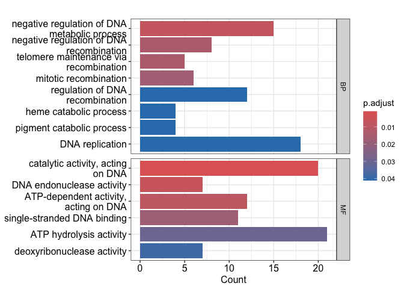

GSE230001
================
Dayou Zou
2024-07-09

``` r
library(affy)
```

    ## Loading required package: BiocGenerics

    ## 
    ## Attaching package: 'BiocGenerics'

    ## The following objects are masked from 'package:stats':
    ## 
    ##     IQR, mad, sd, var, xtabs

    ## The following objects are masked from 'package:base':
    ## 
    ##     anyDuplicated, aperm, append, as.data.frame, basename, cbind,
    ##     colnames, dirname, do.call, duplicated, eval, evalq, Filter, Find,
    ##     get, grep, grepl, intersect, is.unsorted, lapply, Map, mapply,
    ##     match, mget, order, paste, pmax, pmax.int, pmin, pmin.int,
    ##     Position, rank, rbind, Reduce, rownames, sapply, setdiff, sort,
    ##     table, tapply, union, unique, unsplit, which.max, which.min

    ## Loading required package: Biobase

    ## Welcome to Bioconductor
    ## 
    ##     Vignettes contain introductory material; view with
    ##     'browseVignettes()'. To cite Bioconductor, see
    ##     'citation("Biobase")', and for packages 'citation("pkgname")'.

``` r
library(limma)
```

    ## 
    ## Attaching package: 'limma'

    ## The following object is masked from 'package:BiocGenerics':
    ## 
    ##     plotMA

``` r
library(GEOquery)
```

    ## Setting options('download.file.method.GEOquery'='auto')

    ## Setting options('GEOquery.inmemory.gpl'=FALSE)

``` r
library(tinyarray)
```

    ## 

    ## Registered S3 methods overwritten by 'treeio':
    ##   method              from    
    ##   MRCA.phylo          tidytree
    ##   MRCA.treedata       tidytree
    ##   Nnode.treedata      tidytree
    ##   Ntip.treedata       tidytree
    ##   ancestor.phylo      tidytree
    ##   ancestor.treedata   tidytree
    ##   child.phylo         tidytree
    ##   child.treedata      tidytree
    ##   full_join.phylo     tidytree
    ##   full_join.treedata  tidytree
    ##   groupClade.phylo    tidytree
    ##   groupClade.treedata tidytree
    ##   groupOTU.phylo      tidytree
    ##   groupOTU.treedata   tidytree
    ##   inner_join.phylo    tidytree
    ##   inner_join.treedata tidytree
    ##   is.rooted.treedata  tidytree
    ##   nodeid.phylo        tidytree
    ##   nodeid.treedata     tidytree
    ##   nodelab.phylo       tidytree
    ##   nodelab.treedata    tidytree
    ##   offspring.phylo     tidytree
    ##   offspring.treedata  tidytree
    ##   parent.phylo        tidytree
    ##   parent.treedata     tidytree
    ##   root.treedata       tidytree
    ##   rootnode.phylo      tidytree
    ##   sibling.phylo       tidytree

    ## tinyarray v 2.4.2  welcome to use tinyarray!
    ## If you use tinyarray in published research, please acknowledgements:
    ## We thank Dr.Jianming Zeng(University of Macau), and all the members of his bioinformatics team, biotrainee,especially Xiaojie Sun, for generously sharing their experience and codes.

``` r
library(clusterProfiler)
```

    ## clusterProfiler v4.8.3  For help: https://yulab-smu.top/biomedical-knowledge-mining-book/
    ## 
    ## If you use clusterProfiler in published research, please cite:
    ## T Wu, E Hu, S Xu, M Chen, P Guo, Z Dai, T Feng, L Zhou, W Tang, L Zhan, X Fu, S Liu, X Bo, and G Yu. clusterProfiler 4.0: A universal enrichment tool for interpreting omics data. The Innovation. 2021, 2(3):100141

    ## 
    ## Attaching package: 'clusterProfiler'

    ## The following object is masked from 'package:stats':
    ## 
    ##     filter

``` r
library(ggthemes)
library(org.Hs.eg.db)
```

    ## Loading required package: AnnotationDbi

    ## Loading required package: stats4

    ## Loading required package: IRanges

    ## Loading required package: S4Vectors

    ## 
    ## Attaching package: 'S4Vectors'

    ## The following object is masked from 'package:clusterProfiler':
    ## 
    ##     rename

    ## The following object is masked from 'package:utils':
    ## 
    ##     findMatches

    ## The following objects are masked from 'package:base':
    ## 
    ##     expand.grid, I, unname

    ## 
    ## Attaching package: 'IRanges'

    ## The following object is masked from 'package:clusterProfiler':
    ## 
    ##     slice

    ## 
    ## Attaching package: 'AnnotationDbi'

    ## The following object is masked from 'package:clusterProfiler':
    ## 
    ##     select

    ## 

``` r
library(dplyr)
```

    ## 
    ## Attaching package: 'dplyr'

    ## The following object is masked from 'package:AnnotationDbi':
    ## 
    ##     select

    ## The following objects are masked from 'package:IRanges':
    ## 
    ##     collapse, desc, intersect, setdiff, slice, union

    ## The following objects are masked from 'package:S4Vectors':
    ## 
    ##     first, intersect, rename, setdiff, setequal, union

    ## The following object is masked from 'package:tinyarray':
    ## 
    ##     union_all

    ## The following object is masked from 'package:Biobase':
    ## 
    ##     combine

    ## The following objects are masked from 'package:BiocGenerics':
    ## 
    ##     combine, intersect, setdiff, union

    ## The following objects are masked from 'package:stats':
    ## 
    ##     filter, lag

    ## The following objects are masked from 'package:base':
    ## 
    ##     intersect, setdiff, setequal, union

``` r
library(ggplot2)
library(stringr)
library(enrichplot)
library(dplyr)
library(FactoMineR)
library(factoextra) 
```

    ## Welcome! Want to learn more? See two factoextra-related books at https://goo.gl/ve3WBa

``` r
library(hgu219.db)
```

    ## 

``` r
library(pheatmap)
set.seed(1)
```

Expression matrices are provided on GEO, so start from expression
matrices. If no expression matrix on GEO, it can be generated by affy
package.

``` r
# Expression matrices are provided on GEO, so start from expression matrices.
# If no expression matrix on GEO, it can be generated by affy package.
# dir_cels <- "../data/affy/GSE_230001_RAW"
# affydata <- ReadAffy(celfile.path = dir_cels)
# eset <- rma(affydata) or expresso() to specify bgcorrect, normalization,
# pm correct and stat methods.
# mtx <- exprs(eset)
# write.exprs(eset, file = "GSE230001_matrix.txt")
```

Data downloading and exploration

``` r
eSet = getGEO("GSE230001", destdir = '../data/', getGPL = F)
```

    ## Found 1 file(s)

    ## GSE230001_series_matrix.txt.gz

    ## Using locally cached version: ../data//GSE230001_series_matrix.txt.gz

``` r
#extract expression matrix
eSet = eSet[[1]] 
exp <- exprs(eSet)
dim(exp)
```

    ## [1] 49386    24

Draw box plot to check for abnormal samples

``` r
range(exp)
```

    ## [1]  1.881352 13.279250

``` r
boxplot(exp, las = 2)
```

<!-- -->

``` r
exp <- exp[,1:6] # take subset of first 6 samples for training
```

Extract clinical information and gpl number for following annotation

``` r
pd <- pData(eSet)[1:6,]

# Check if exp colnames match pd rownames
p <- identical(rownames(pd), colnames(exp)); p
```

    ## [1] TRUE

``` r
gpl_number <- eSet@annotation; gpl_number
```

    ## [1] "GPL13667"

Organize group information

``` r
k = str_detect(pd$title, "control"); k
```

    ## [1]  TRUE  TRUE  TRUE FALSE FALSE FALSE

``` r
group <- ifelse(k, "control", "estradiol")

group <- factor(group, levels = c("control","estradiol")); group
```

    ## [1] control   control   control   estradiol estradiol estradiol
    ## Levels: control estradiol

Get array annotation by tinyarray

``` r
# get 
find_anno(gpl_number)
```

    ## `library(hgu219.db);ids <- toTable(hgu219SYMBOL)` and `ids <- AnnoProbe::idmap('GPL13667')` are both avaliable

    ## if you get error by idmap, please try different `type` parameters

``` r
# get code from output above
library(hgu219.db);ids <- toTable(hgu219SYMBOL)
head(ids)
```

    ##        probe_id    symbol
    ## 1   11715100_at      H3C8
    ## 2 11715101_s_at      H3C8
    ## 3 11715102_x_at      H3C8
    ## 4 11715103_x_at TNFAIP8L1
    ## 5 11715104_s_at     OTOP2
    ## 6   11715105_at  C17orf78

Check PCA plot and heatmap

``` r
dat=as.data.frame(t(exp))
dat.pca <- PCA(dat, graph = FALSE)

p_pca<- fviz_pca_ind(dat.pca,
             geom.ind = "point", 
             col.ind = group,
             palette = c("#00AFBB", "#E7B800"),
             addEllipses = TRUE, 
             legend.title = "Groups"
)
p_pca
```

    ## Too few points to calculate an ellipse
    ## Too few points to calculate an ellipse

<!-- -->

``` r
ggsave("../results/PCA.pdf", plot = p_pca)
```

    ## Saving 7 x 5 in image
    ## Too few points to calculate an ellipse
    ## Too few points to calculate an ellipse

heatmap for top1000 genes with high sd

``` r
g = names(tail(sort(apply(exp,1,sd)),1000))
n = exp[g,]

annotation_col = data.frame(row.names = colnames(n),
                            Group = group)

p_heatmap_1000 <- pheatmap(n,
         show_colnames =F,
         show_rownames = F,
         annotation_col=annotation_col,
         scale = "row", 
         breaks = seq(-3,3,length.out = 100) 
         ) 
p_heatmap_1000
```

<!-- -->

``` r
ggsave("../results/heatmap_1000.pdf", plot = p_heatmap_1000)
```

    ## Saving 7 x 5 in image

DE analysis (log2FC threshold is released due to few DEGs)

``` r
# DE 
design = model.matrix(~group)
fit = lmFit(exp,design)
fit = eBayes(fit)
deg = topTable(fit,coef = 2,number = Inf)

# add probe_id info
deg = mutate(deg,probe_id = rownames(deg))
ids = distinct(ids,symbol,.keep_all = T)
deg = inner_join(deg,ids,by="probe_id")
nrow(deg)
```

    ## [1] 18449

``` r
# add regulate label
logFC_t = 0.25
p_t = 0.05
k1 = (deg$P.Value < p_t)&(deg$logFC < -logFC_t)
k2 = (deg$P.Value < p_t)&(deg$logFC > logFC_t)
deg = mutate(deg,change = ifelse(k1,"down",ifelse(k2,"up","stable")))
table(deg$change)
```

    ## 
    ##   down stable     up 
    ##    260  17985    204

Volcano plot

``` r
p_vol <- ggplot(data = deg, aes(x = logFC, y = -log10(P.Value))) +
  geom_point(alpha=0.4, size=3.5, aes(color=change)) +
  scale_color_manual(values=c("blue", "grey","red"))+
  geom_vline(xintercept=c(-logFC_t,logFC_t),lty=4,col="black",linewidth=0.8) +
  geom_hline(yintercept = -log10(p_t),lty=4,col="black",linewidth=0.8) +
  theme_bw()
p_vol
```

<!-- -->

``` r
ggsave("../results/volcano.pdf", plot = p_vol)
```

    ## Saving 7 x 5 in image

Heatmap for DEGs

``` r
exp = exp[deg$probe_id,]
rownames(exp) = deg$symbol
diff_gene = deg$symbol[deg$change !="stable"]
n = exp[diff_gene,]
```

``` r
annotation_col = data.frame(group = group)
rownames(annotation_col) = colnames(n) 
p_heatmap_deg <- pheatmap(n,show_colnames =F,
         show_rownames = F,
         scale = "row",
         #cluster_cols = F, 
         annotation_col=annotation_col,
         breaks = seq(-3,3,length.out = 100)
) 
p_heatmap_deg
```

<!-- -->

``` r
ggsave("../results/heatmap_degs.pdf", plot = p_heatmap_deg)
```

    ## Saving 7 x 5 in image

Convert gene symbol to ENTREZID

``` r
s2e = bitr(deg$symbol, 
           fromType = "SYMBOL",
           toType = "ENTREZID",
           OrgDb = org.Hs.eg.db)
```

    ## 'select()' returned 1:many mapping between keys and columns

``` r
deg = inner_join(deg,s2e,by=c("symbol"="SYMBOL"))

gene_diff = deg$ENTREZID[deg$change != "stable"] 
```

Enrichment analysis

``` r
ekk <- enrichKEGG(gene = gene_diff,organism = 'hsa',pvalueCutoff = 1,qvalueCutoff = 1)
```

    ## Reading KEGG annotation online: "https://rest.kegg.jp/link/hsa/pathway"...

    ## Reading KEGG annotation online: "https://rest.kegg.jp/list/pathway/hsa"...

``` r
ekk <- setReadable(ekk,OrgDb = org.Hs.eg.db,keyType = "ENTREZID")
ego <- enrichGO(gene = gene_diff,OrgDb= org.Hs.eg.db,
                ont = "ALL",readable = TRUE)

class(ekk)
```

    ## [1] "enrichResult"
    ## attr(,"package")
    ## [1] "DOSE"

``` r
# visualization
p_go <- barplot(ego, split = "ONTOLOGY") + 
  facet_grid(ONTOLOGY ~ ., space = "free_y",scales = "free_y")
p_go
```

<!-- -->

``` r
ggsave("../results/GO.pdf", plot = p_go, height = 7, width = 7)

p_kkeg <- barplot(ekk); p_kkeg
```

<!-- -->

``` r
ggsave("../results/KEGG.pdf", plot = p_kkeg, height = 5, width = 7)
```

``` r
devtools::install_github("junjunlab/GseaVis")
```

    ## Skipping install of 'GseaVis' from a github remote, the SHA1 (8e96d898) has not changed since last install.
    ##   Use `force = TRUE` to force installation

``` r
ego_df <- data.frame(ego) %>% 
  head(10)
```

``` r
library(GseaVis)
```

    ## Warning: replacing previous import 'AnnotationDbi::select' by 'dplyr::select'
    ## when loading 'GseaVis'

    ## Warning: replacing previous import 'purrr::exec' by 'yulab.utils::exec' when
    ## loading 'GseaVis'

    ## Registered S3 methods overwritten by 'ggpp':
    ##   method                  from   
    ##   heightDetails.titleGrob ggplot2
    ##   widthDetails.titleGrob  ggplot2

``` r
sankeyGoPlot(goData = ego_df)
```

    ## Warning in geom_text(data = ps_data_info, mapping = aes(next_x = 0, next_node =
    ## 0, : Ignoring unknown aesthetics: next_x and next_node

<!-- -->

``` r
# adjust parameters to align the images
p_sgo <- sankeyGoPlot(goData = ego_df,
                      downShift = 8, upShift = 2,
                      sankeyExpand = c(0.4,1))
```

    ## Warning in geom_text(data = ps_data_info, mapping = aes(next_x = 0, next_node =
    ## 0, : Ignoring unknown aesthetics: next_x and next_node

``` r
p_sgo
```

<!-- -->

``` r
ggsave("../results/sankey_go.pdf",p_sgo)
```

    ## Saving 7 x 5 in image
