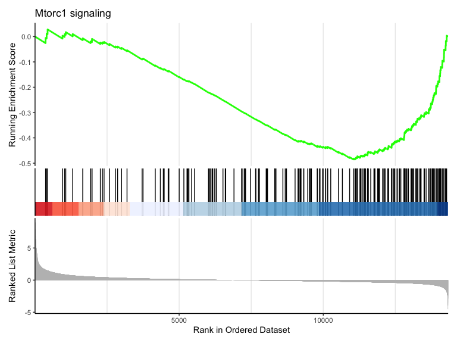

GSE193861
================
Dayou Zou
2024-07-25

``` r
library(tinyarray)
library(stringr)
library(DESeq2)
library(edgeR)
library(limma)
library(dplyr)
library(ggplot2)
library(patchwork)
library(ComplexHeatmap)
library(circlize)
library(GSEABase) 
library(clusterProfiler)
library(org.Hs.eg.db)
library(enrichplot)
library(msigdbr)
library(ggthemes)
```

``` r
proj = "Doxorubicin"

# data read in 
r1 = function(f){
  read.delim(paste0("GSE193861_RAW/",f),header = F,row.names = 1)
}

fs = dir("GSE193861_RAW/")
dat = lapply(fs, r1)

exp = do.call(cbind,dat)

colnames(exp) = str_split_i(fs,"_|\\.",2)
```

``` r
# clinical data
clinical = geo_download("GSE193861",colon_remove = T)$pd
```

``` r
# transform colnames to ID
exp = trans_exp_new(exp)
exp[1:4,1:4]
#>             con1 con2 con3 con4
#> DDX11L1        0    0    0    0
#> WASH7P        30   11    4   33
#> MIR1302-2HG    0    0    0    0
#> FAM138A        0    0    0    0
```

Before filtering:

``` r
nrow(exp)
#> [1] 52343
```

``` r
# filtering: keep genes which expressed in more than half samples
exp = exp[apply(exp, 1, function(x) sum(x > 0) > 0.5*ncol(exp)), ]
nrow(exp)
#> [1] 20383
```

``` r
# get group info
colnames(exp)
#>  [1] "con1" "con2" "con3" "con4" "con5" "DOX1" "DOX2" "DOX3" "DOX4" "DOX6"
Group = str_remove_all(colnames(exp),"\\d")
Group = factor(Group,levels = c("con","DOX"))
table(Group)
#> Group
#> con DOX 
#>   5   5
```

Do DE analysis separately, and take intersection.

``` r
#deseq2----
colData <- data.frame(row.names =colnames(exp), 
                      condition=Group)
# check if rdata exist, delete rdata and rerun if exp changed
if(!file.exists(paste0(proj,"_dd.Rdata"))){
  dds <- DESeqDataSetFromMatrix(
  countData = exp,
  colData = colData,
  design = ~ condition)
  dds <- DESeq(dds)
  save(dds,file = paste0(proj,"_dd.Rdata"))
}
load(file = paste0(proj,"_dd.Rdata"))
class(dds)
#> [1] "DESeqDataSet"
#> attr(,"package")
#> [1] "DESeq2"
res <- results(dds, contrast = c("condition",rev(levels(Group))))
#constrast
c("condition",rev(levels(Group)))
#> [1] "condition" "DOX"       "con"
class(res)
#> [1] "DESeqResults"
#> attr(,"package")
#> [1] "DESeq2"
DEG1 <- as.data.frame(res)
DEG1 <- arrange(DEG1,pvalue)
DEG1 = na.omit(DEG1)
head(DEG1)
#>            baseMean log2FoldChange     lfcSE      stat       pvalue
#> XIST     1113.44045       7.745398 1.1590688  6.682431 2.350101e-11
#> RELN       73.77183       3.181230 0.5878329  5.411793 6.239663e-08
#> MYH6     5722.85394      -2.937321 0.5486449 -5.353774 8.613828e-08
#> MME        89.49695       2.608529 0.5694700  4.580625 4.635893e-06
#> MTCO2P12   54.33513       4.692185 1.0293695  4.558310 5.156698e-06
#> SNORA65    40.60296       4.697523 1.0357679  4.535305 5.752034e-06
#>                  padj
#> XIST     3.659577e-07
#> RELN     4.471151e-04
#> MYH6     4.471151e-04
#> MME      1.492844e-02
#> MTCO2P12 1.492844e-02
#> SNORA65  1.492844e-02

# add label for up and down reg
logFC_t = 1
pvalue_t = 0.05

k1 = (DEG1$pvalue < pvalue_t)&(DEG1$log2FoldChange < -logFC_t);table(k1)
#> k1
#> FALSE  TRUE 
#> 15466   106
k2 = (DEG1$pvalue < pvalue_t)&(DEG1$log2FoldChange > logFC_t);table(k2)
#> k2
#> FALSE  TRUE 
#> 15268   304
DEG1$change = ifelse(k1,"DOWN",ifelse(k2,"UP","NOT"))
table(DEG1$change)
#> 
#>  DOWN   NOT    UP 
#>   106 15162   304
head(DEG1)
#>            baseMean log2FoldChange     lfcSE      stat       pvalue
#> XIST     1113.44045       7.745398 1.1590688  6.682431 2.350101e-11
#> RELN       73.77183       3.181230 0.5878329  5.411793 6.239663e-08
#> MYH6     5722.85394      -2.937321 0.5486449 -5.353774 8.613828e-08
#> MME        89.49695       2.608529 0.5694700  4.580625 4.635893e-06
#> MTCO2P12   54.33513       4.692185 1.0293695  4.558310 5.156698e-06
#> SNORA65    40.60296       4.697523 1.0357679  4.535305 5.752034e-06
#>                  padj change
#> XIST     3.659577e-07     UP
#> RELN     4.471151e-04     UP
#> MYH6     4.471151e-04   DOWN
#> MME      1.492844e-02     UP
#> MTCO2P12 1.492844e-02     UP
#> SNORA65  1.492844e-02     UP

#edgeR----
dge <- DGEList(counts=exp,group=Group)
dge$samples$lib.size <- colSums(dge$counts)
dge <- calcNormFactors(dge) 

design <- model.matrix(~Group)

dge <- estimateGLMCommonDisp(dge, design)
dge <- estimateGLMTrendedDisp(dge, design)
dge <- estimateGLMTagwiseDisp(dge, design)

fit <- glmFit(dge, design)
fit <- glmLRT(fit) 

DEG2=topTags(fit, n=Inf)
class(DEG2)
#> [1] "TopTags"
#> attr(,"package")
#> [1] "edgeR"
DEG2=as.data.frame(DEG2)
head(DEG2)
#>           logFC     logCPM       LR       PValue          FDR
#> XIST   7.726373  6.1664739 40.20223 2.289862e-10 4.667425e-06
#> RELN   3.142138  2.1513189 35.75146 2.241634e-09 2.284561e-05
#> ADIPOQ 6.768696  1.9737844 31.43692 2.060263e-08 1.399812e-04
#> UNC80  5.578451 -0.3805617 30.80077 2.859249e-08 1.457002e-04
#> PLPPR4 4.152559 -1.2836374 29.23704 6.404325e-08 2.610787e-04
#> MMRN1  3.066753  0.8954184 28.74066 8.274819e-08 2.811094e-04

k1 = (DEG2$PValue < pvalue_t)&(DEG2$logFC < -logFC_t)
k2 = (DEG2$PValue < pvalue_t)&(DEG2$logFC > logFC_t)
DEG2$change = ifelse(k1,"DOWN",ifelse(k2,"UP","NOT"))

head(DEG2)
#>           logFC     logCPM       LR       PValue          FDR change
#> XIST   7.726373  6.1664739 40.20223 2.289862e-10 4.667425e-06     UP
#> RELN   3.142138  2.1513189 35.75146 2.241634e-09 2.284561e-05     UP
#> ADIPOQ 6.768696  1.9737844 31.43692 2.060263e-08 1.399812e-04     UP
#> UNC80  5.578451 -0.3805617 30.80077 2.859249e-08 1.457002e-04     UP
#> PLPPR4 4.152559 -1.2836374 29.23704 6.404325e-08 2.610787e-04     UP
#> MMRN1  3.066753  0.8954184 28.74066 8.274819e-08 2.811094e-04     UP
table(DEG2$change)
#> 
#>  DOWN   NOT    UP 
#>   344 19256   783

#limma----

dge <- edgeR::DGEList(counts=exp)
dge <- edgeR::calcNormFactors(dge)
design <- model.matrix(~Group)
v <- voom(dge,design, normalize="quantile")

fit <- lmFit(v, design)
fit= eBayes(fit)

DEG3 = topTable(fit, coef=2, n=Inf)
DEG3 = na.omit(DEG3)

k1 = (DEG3$P.Value < pvalue_t)&(DEG3$logFC < -logFC_t)
k2 = (DEG3$P.Value < pvalue_t)&(DEG3$logFC > logFC_t)
DEG3$change = ifelse(k1,"DOWN",ifelse(k2,"UP","NOT"))
table(DEG3$change)
#> 
#>  DOWN   NOT    UP 
#>   200 19743   440
head(DEG3)
#>            logFC   AveExpr         t      P.Value adj.P.Val         B change
#> RYR2   -1.602209 10.186360 -4.087521 0.0013467451 0.9820625 -3.140559   DOWN
#> MT-ND5  1.437690 10.392968  3.664636 0.0029671911 0.9820625 -3.263672     UP
#> MT-ND3  1.191078  9.677601  2.933701 0.0118911929 0.9940732 -3.709765     UP
#> DES    -1.004170 10.901441 -2.588390 0.0228599216 0.9940732 -3.797395   DOWN
#> XIST    6.385181  2.303796  5.287750 0.0001594876 0.5418061 -3.840880     UP
#> PDK4    2.835272  6.800228  3.363489 0.0052476916 0.9940732 -3.891868     UP
```

``` r
tj = data.frame(deseq2 = as.integer(table(DEG1$change)),
           edgeR = as.integer(table(DEG2$change)),
           limma_voom = as.integer(table(DEG3$change)),
           row.names = c("down","not","up")
          );tj
#>      deseq2 edgeR limma_voom
#> down    106   344        200
#> not   15162 19256      19743
#> up      304   783        440
save(DEG1,DEG2,DEG3,Group,tj,file = paste0(proj,"_DEG.Rdata"))
```

``` r
dat = log2(cpm(exp)+1) # cpm: Remove the effect of library size
pca.plot = draw_pca(dat,Group);pca.plot
```

<!-- -->

``` r
#save(pca.plot,file = paste0(proj,"_pcaplot.Rdata"))
```

``` r
cg1 = rownames(DEG1)[DEG1$change !="NOT"]
cg2 = rownames(DEG2)[DEG2$change !="NOT"]
cg3 = rownames(DEG3)[DEG3$change !="NOT"]

h1 = draw_heatmap(dat[cg1,],Group)
h2 = draw_heatmap(dat[cg2,],Group)
h3 = draw_heatmap(dat[cg3,],Group)

v1 = draw_volcano(DEG1,pkg = 1,logFC_cutoff = logFC_t)
v2 = draw_volcano(DEG2,pkg = 2,logFC_cutoff = logFC_t)
v3 = draw_volcano(DEG3,pkg = 3,logFC_cutoff = logFC_t)


(h1 + h2 + h3) / (v1 + v2 + v3) +plot_layout(guides = 'collect') &theme(legend.position = "none")
```

<!-- -->

``` r

ggsave(paste0(proj,"_heat_vo.png"),width = 15,height = 10)
```

``` r
UP=function(df){
  rownames(df)[df$change=="UP"]
}
DOWN=function(df){
  rownames(df)[df$change=="DOWN"]
}

up = intersect(intersect(UP(DEG1),UP(DEG2)),UP(DEG3))
down = intersect(intersect(DOWN(DEG1),DOWN(DEG2)),DOWN(DEG3))
dat = log2(cpm(exp)+1)
hp = draw_heatmap(dat[c(up,down),],Group,cluster_cols = F)

up_genes = list(Deseq2 = UP(DEG1),
          edgeR = UP(DEG2),
          limma = UP(DEG3))

down_genes = list(Deseq2 = DOWN(DEG1),
          edgeR = DOWN(DEG2),
          limma = DOWN(DEG3))

up.plot <- draw_venn(up_genes,"UPgene")
down.plot <- draw_venn(down_genes,"DOWNgene")

pca.plot + hp+up.plot +down.plot+ plot_layout(guides = "collect")
ggsave(paste0(proj,"_heat_ve_pca.png"),width = 15,height = 10)
```


``` r
col_fun = colorRamp2(c(-2, 0, 2), c("#2fa1dd", "white", "#f87669"))
top_annotation = HeatmapAnnotation(
  cluster = anno_block(gp = gpar(fill = c("#f87669","#2fa1dd")),
                       labels = levels(Group),
                       labels_gp = gpar(col = "white", fontsize = 12)))

m = Heatmap(t(scale(t(exp[c(up,down),]))),name = " ",
            col = col_fun,
        top_annotation = top_annotation,
        column_split = Group,
        show_heatmap_legend = T,
        border = F,
        show_column_names = F,
        show_row_names = F,
        use_raster = F,
        cluster_column_slices = F,
        column_title = NULL)
m
```

<!-- -->

Enrichment analysis

``` r
# take degs from DEseq2 output
deg = DEG1
output <- bitr(rownames(deg),
               fromType = 'SYMBOL',
               toType = 'ENTREZID',
               OrgDb = 'org.Hs.eg.db')
deg = merge(deg,output,by.x = "row.names",by.y = "SYMBOL")

ge = deg$log2FoldChange # NAME!!!
names(ge) = deg$Row.names
ge = sort(ge,decreasing = T)
head(ge)
#> RNA5SP226    KCTD16      XIST    SLC9C2 RNA5SP202 RNA5SP370 
#>  8.979912  7.918662  7.745398  7.570163  7.328104  7.328023

geneset <- msigdbr(species = "Homo sapiens",category = "H") %>%
  dplyr::select(gs_name,gene_symbol)
geneset[1:4,]
#> # A tibble: 4 × 2
#>   gs_name               gene_symbol
#>   <chr>                 <chr>      
#> 1 HALLMARK_ADIPOGENESIS ABCA1      
#> 2 HALLMARK_ADIPOGENESIS ABCB8      
#> 3 HALLMARK_ADIPOGENESIS ACAA2      
#> 4 HALLMARK_ADIPOGENESIS ACADL
geneset$gs_name = geneset$gs_name %>%
  str_split("_",simplify = T,n = 2)%>%
  .[,2]%>%
  str_replace_all("_"," ") %>% 
  str_to_sentence()
em <- GSEA(ge, TERM2GENE = geneset)
dim(em)
#> [1] 18 11

gseaplot2(em, geneSetID = 1, title = em$Description[1])
```

<!-- -->

``` r
gseaplot2(em, geneSetID = 1:3,pvalue_table = T) # multiple pathways
```

<!-- -->

``` r

dotplot(em,split=".sign")+facet_grid(~.sign)
```

<!-- -->

``` r
ridgeplot(em)
```

<!-- -->

ORA:

``` r
# take intersection of 3 DEG outputs, function from tinyarray
g = intersect_all(rownames(DEG1)[DEG1$change!="NOT"],
                  rownames(DEG2)[DEG2$change!="NOT"],
                  rownames(DEG3)[DEG3$change!="NOT"])
output <- bitr(g,
             fromType = 'SYMBOL',
             toType = 'ENTREZID',
             OrgDb = 'org.Hs.eg.db')
gene_diff = output$ENTREZID

ekk <- enrichKEGG(gene = gene_diff,
                  organism = 'hsa', pvalueCutoff = 1 )
ekk <- setReadable(ekk,
                   OrgDb = org.Hs.eg.db,
                   keyType = "ENTREZID")
ego <- enrichGO(gene = gene_diff,
                OrgDb= org.Hs.eg.db,
                ont = "ALL",
                readable = TRUE)

barplot(ego, split = "ONTOLOGY") + 
  facet_grid(ONTOLOGY ~ ., space = "free_y",scales = "free_y") 
```

<!-- -->

``` r
barplot(ekk)
```

<!-- -->

``` r
dotplot(ekk)
```

<!-- -->
