GSE201925
================
Dayou Zou
2024-02-19

Import packages.

``` r
rm(list=ls())
options(stringsAsFactors = F) 
library(Seurat)
library(ggplot2)
library(clustree)
library(cowplot)
library(dplyr)
library(reshape2)
library(stringr)
library(tidyverse)
library(gplots)
library(ggpubr)
library(patchwork)
library(ggsci)
```

``` r
set.seed(1)
```

Import raw data.

``` r
# dir_name = list.dirs('./data/GSE201925_raw/')[-1]
# 
# count = Read10X(dir_name)
# scRNAlist <- list()
# 
# for (i in 1: length(dir_name)){
#   
#   # Read output of cellranger
#   sample <- Read10X(data.dir = paste('./GSE201925_raw/',dir_name[i], sep = ''))
#   
#   # Create seurat subject, with min cell nember = 3, min feature = 200 (from Seurat document)
#   scRNAlist[[i]] <- CreateSeuratObject(sample, project = dir_name[i], min.cells = 3, min.features = 200)
# }
```

``` r
dir_name = list.dirs('../data/GSE201925_raw/')[-1]
cts = Read10X(dir_name)

sce.all = CreateSeuratObject(counts = cts, min.cells = 5, min.features = 300)
```

QC.

``` r
# Calculate percentage of mitochondrial gene ratio
head(row.names(sce.all))
```

    ## [1] "AL627309.1" "AL627309.5" "LINC01409"  "FAM87B"     "LINC01128" 
    ## [6] "LINC00115"

``` r
mito_genes=rownames(sce.all)[grep("^MT-", rownames(sce.all))] 
mito_genes 
```

    ##  [1] "MT-ND1"  "MT-ND2"  "MT-CO1"  "MT-CO2"  "MT-ATP8" "MT-ATP6" "MT-CO3" 
    ##  [8] "MT-ND3"  "MT-ND4L" "MT-ND4"  "MT-ND5"  "MT-ND6"  "MT-CYB"

``` r
sce.all=PercentageFeatureSet(sce.all, "^MT-", col.name = "percent_mito")
fivenum(sce.all@meta.data$percent_mito)
```

    ## [1]  0.0000000  0.7536514  1.4658609  3.0351794 82.1976673

``` r
# Calculate ribosomal gene ratio
ribo_genes=rownames(sce.all)[grep("^Rp[sl]", rownames(sce.all),ignore.case = T)]
ribo_genes
```

    ##  [1] "RPL22"       "RPL11"       "RPS6KA1"     "RPS8"        "RPL5"       
    ##  [6] "RPS27"       "RPS6KC1"     "RPS7"        "RPS27A"      "RPL31"      
    ## [11] "RPL37A"      "RPL32"       "RPL15"       "RPSA"        "RPL14"      
    ## [16] "RPL29"       "RPL24"       "RPL22L1"     "RPL39L"      "RPL35A"     
    ## [21] "RPL9"        "RPL34-AS1"   "RPL34"       "RPS3A"       "RPL37"      
    ## [26] "RPS23"       "RPS14"       "RPL26L1"     "RPS18"       "RPS10-NUDT3"
    ## [31] "RPS10"       "RPL10A"      "RPL7L1"      "RPS12"       "RPS6KA2"    
    ## [36] "RPS20"       "RPL7"        "RPL30"       "RPL8"        "RPS6"       
    ## [41] "RPL35"       "RPL12"       "RPL7A"       "RPS24"       "RPLP2"      
    ## [46] "RPL27A"      "RPS13"       "RPS6KA4"     "RPS6KB2"     "RPS6KB2-AS1"
    ## [51] "RPS3"        "RPS25"       "RPS26"       "RPL41"       "RPL6"       
    ## [56] "RPLP0"       "RPL21"       "RPS29"       "RPL36AL"     "RPS6KL1"    
    ## [61] "RPS6KA5"     "RPS27L"      "RPL4"        "RPLP1"       "RPS17"      
    ## [66] "RPL3L"       "RPS2"        "RPS15A"      "RPL13"       "RPL26"      
    ## [71] "RPL23A"      "RPL23"       "RPL19"       "RPL27"       "RPS6KB1"    
    ## [76] "RPL38"       "RPL17"       "RPS15"       "RPL36"       "RPS28"      
    ## [81] "RPL18A"      "RPS16"       "RPS19"       "RPL18"       "RPL13A"     
    ## [86] "RPS11"       "RPS9"        "RPL28"       "RPS5"        "RPS21"      
    ## [91] "RPL3"        "RPS19BP1"    "RPS6KA3"     "RPS4X"       "RPS6KA6"    
    ## [96] "RPL36A"      "RPL39"       "RPL10"

``` r
sce.all=PercentageFeatureSet(sce.all, "^RP[SL]", col.name = "percent_ribo")
fivenum(sce.all@meta.data$percent_ribo)
```

    ## [1]  0.3571429 12.0969998 15.2867742 19.0635334 60.6518092

``` r
# Calculate red blood cell gene ratio
hb_genes <- rownames(sce.all)[grep("^Hb[^(p)]", rownames(sce.all),ignore.case = T)]
hb_genes
```

    ## [1] "HBEGF" "HBS1L" "HBB"   "HBD"   "HBG2"  "HBM"   "HBA2"  "HBA1"  "HBQ1"

``` r
sce.all=PercentageFeatureSet(sce.all, "^HB[^(P)]", col.name = "percent_hb")
fivenum(sce.all@meta.data$percent_hb)
```

    ## [1]  0.000000000  0.000000000  0.000000000  0.003863614 80.800201309

Visualization before QC

``` r
feats <- c("nFeature_RNA", "nCount_RNA", "percent_mito", "percent_ribo", "percent_hb")
violin_before <- list()

# Create group info
sce.all$group<-ifelse(grepl(1,sce.all$orig.ident),"Control",
                      ifelse(grepl(2,sce.all$orig.ident),"ADU-S100 10µM","ADU-S100 50µM"))
table(sce.all$group)
```

    ## 
    ## ADU-S100 10µM ADU-S100 50µM       Control 
    ##          8137         11171          1343

``` r
for (i in 1:length(feats)){
  violin_before[[i]] <-VlnPlot(sce.all, group.by = "group", features = feats[i], ncol = 1, pt.size = 0)
  ggsave(filename=paste0(feats[i],".pdf"),plot=violin_before[[i]],path = "../results/1-QC/")
}
```

    ## Saving 7 x 5 in image
    ## Saving 7 x 5 in image
    ## Saving 7 x 5 in image
    ## Saving 7 x 5 in image
    ## Saving 7 x 5 in image

``` r
violin_before
```

    ## [[1]]

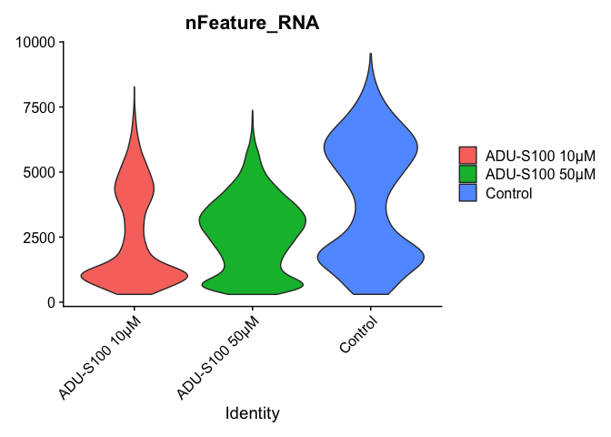<!-- -->

    ## 
    ## [[2]]

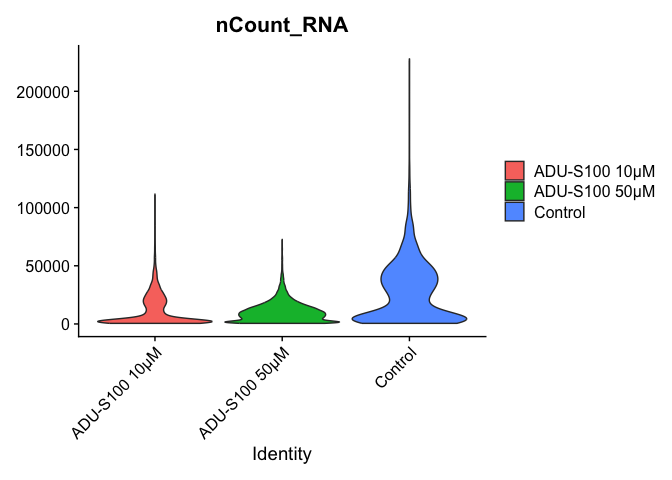<!-- -->

    ## 
    ## [[3]]

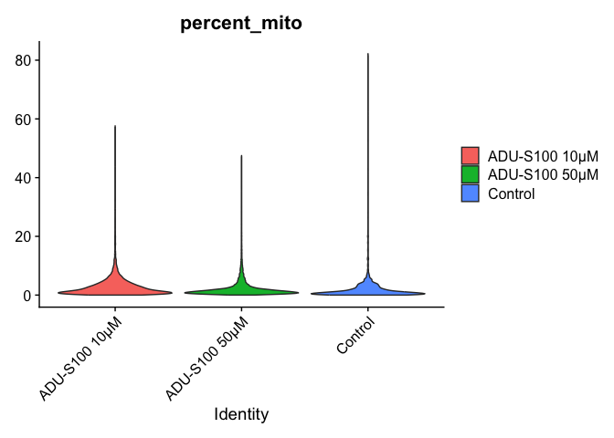<!-- -->

    ## 
    ## [[4]]

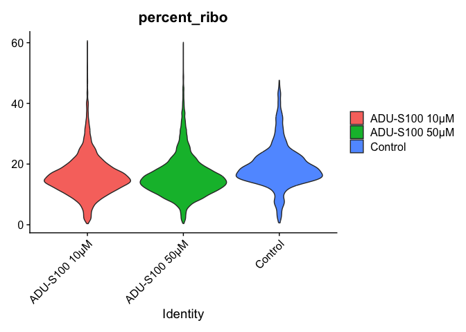<!-- -->

    ## 
    ## [[5]]

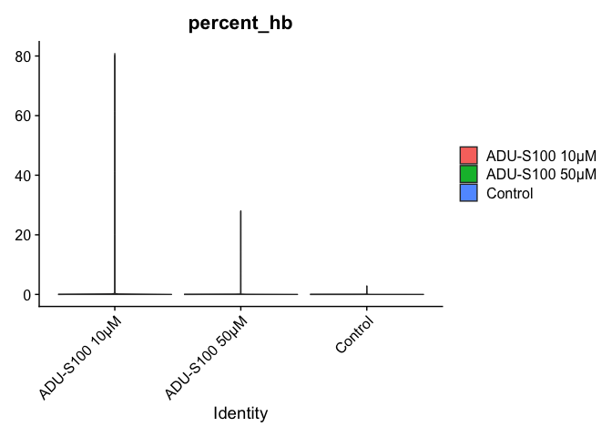<!-- -->

``` r
feats <- c("percent_mito", "percent_ribo", "percent_hb")
p2=VlnPlot(sce.all, group.by = "group", features = feats, pt.size = 0, ncol = 3, same.y.lims=T) + 
  scale_y_continuous(breaks=seq(0, 100, 5)) +
  NoLegend()
```

    ## Warning: Default search for "data" layer in "RNA" assay yielded no results;
    ## utilizing "counts" layer instead.

    ## Scale for y is already present.
    ## Adding another scale for y, which will replace the existing scale.

``` r
p2  
```

    ## Warning: Removed 1 row containing non-finite outside the scale range
    ## (`stat_ydensity()`).

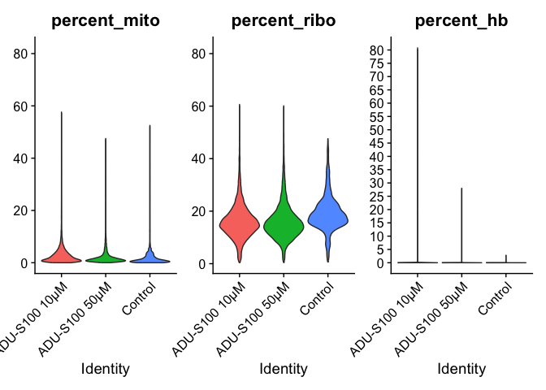<!-- -->

``` r
ggsave(filename="Vlnplot_same_yaxis_before.pdf",plot=p2,path = "../results/1-QC/")
```

    ## Saving 7 x 5 in image

    ## Warning: Removed 1 row containing non-finite outside the scale range
    ## (`stat_ydensity()`).

``` r
# Check cell numbers after filtring
selected_mito <- WhichCells(sce.all, expression = percent_mito < 15)
selected_ribo <- WhichCells(sce.all, expression = percent_ribo > 3)
selected_hb <- WhichCells(sce.all, expression = percent_hb < 1 )
length(selected_hb)
```

    ## [1] 20599

``` r
length(selected_ribo)
```

    ## [1] 20413

``` r
length(selected_mito)
```

    ## [1] 20356

``` r
sce.all.filt <- sce.all
sce.all.filt <- subset(sce.all.filt, cells = selected_mito)
sce.all.filt <- subset(sce.all.filt, cells = selected_ribo)
sce.all.filt <- subset(sce.all.filt, cells = selected_hb)
dim(sce.all.filt)
```

    ## [1] 22959 20147

``` r
table(sce.all.filt$group) 
```

    ## 
    ## ADU-S100 10µM ADU-S100 50µM       Control 
    ##          7915         10914          1318

Visualization after filtering

``` r
feats <- c("nFeature_RNA", "nCount_RNA")
p1_filtered=VlnPlot(sce.all.filt, group.by = "group", features = feats, pt.size = 0, ncol = 2) + 
  NoLegend()
```

    ## Warning: Default search for "data" layer in "RNA" assay yielded no results;
    ## utilizing "counts" layer instead.

``` r
ggsave(filename="Vlnplot1_filtered.pdf",plot=p1_filtered,path = "../results/1-QC/")
```

    ## Saving 7 x 5 in image

``` r
feats <- c("percent_mito", "percent_ribo", "percent_hb")
p2_filtered=VlnPlot(sce.all.filt, group.by = "group", features = feats, pt.size = 0, ncol = 3) + 
  NoLegend()
```

    ## Warning: Default search for "data" layer in "RNA" assay yielded no results;
    ## utilizing "counts" layer instead.

``` r
ggsave(filename="Vlnplot2_filtered.pdf",plot=p2_filtered,path = "../results/1-QC/")
```

    ## Saving 7 x 5 in image

``` r
p1_filtered
```

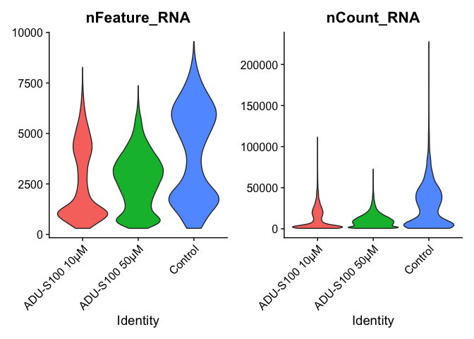<!-- -->

``` r
p2_filtered
```

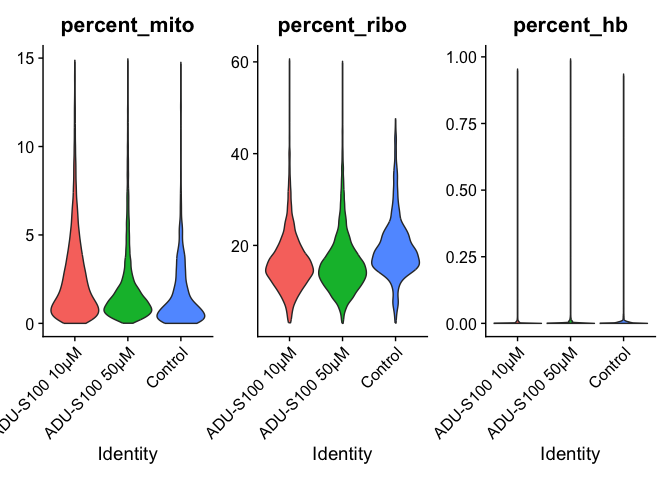<!-- -->

Filter out specific gene(like housekeeping genes if needed)

``` r
# Filter MALAT1 
#sce.all.filt <- sce.all.filt[!grepl("MALAT1", rownames(sce.all.filt),ignore.case = T), ]
# Filter Mitocondrial
#sce.all.filt <- sce.all.filt[!grepl("^MT-", rownames(sce.all.filt),ignore.case = T), ]

#dim(sce.all.filt) 
```

Cell-Cycle Scoring

``` r
sce.all.filt = NormalizeData(sce.all.filt)
```

    ## Normalizing layer: counts

``` r
s.genes=Seurat::cc.genes.updated.2019$s.genes
g2m.genes=Seurat::cc.genes.updated.2019$g2m.genes
sce.all.filt=CellCycleScoring(object = sce.all.filt,
                              s.features = s.genes,
                              g2m.features = g2m.genes,
                              set.ident = TRUE)
p4=VlnPlot(sce.all.filt, features = c("S.Score", "G2M.Score"), group.by = "group",
           ncol = 2, pt.size = 0)
```

``` r
ggsave(filename="Vlnplot4_cycle.pdf", plot=p4, path = "../results/1-QC/")
```

    ## Saving 7 x 5 in image

``` r
sce.all.filt@meta.data  %>% ggplot(aes(S.Score,G2M.Score))+geom_point(aes(color=Phase))+
  theme_minimal()
```

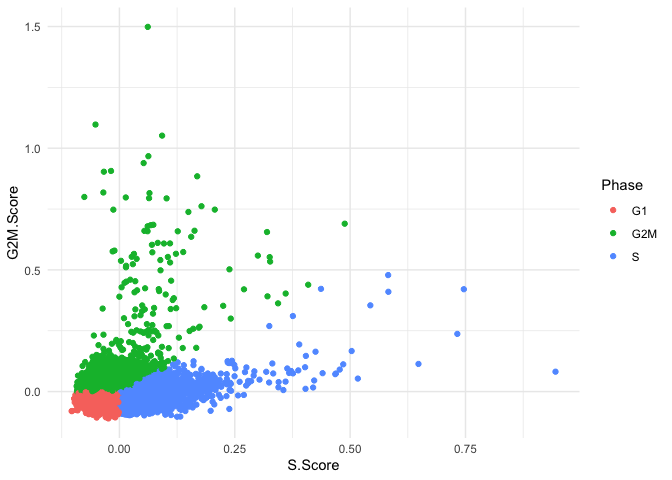<!-- -->

``` r
ggsave(filename="cycle_details.pdf", path = "../results/1-QC/" )
```

    ## Saving 7 x 5 in image

Harmony

``` r
dir.create("../results/2-harmony")
```

    ## Warning in dir.create("../results/2-harmony"): '../results/2-harmony' already
    ## exists

``` r
sce <- sce.all.filt
sce <- NormalizeData(sce, normalization.method = "LogNormalize", scale.factor = 1e4) 
```

    ## Normalizing layer: counts

``` r
sce <- FindVariableFeatures(sce) 
```

    ## Finding variable features for layer counts

``` r
sce <- ScaleData(sce)
```

    ## Centering and scaling data matrix

``` r
sce <- RunPCA(sce, features = VariableFeatures(object = sce))
```

    ## PC_ 1 
    ## Positive:  CXCR4, IL2RG, ARHGDIB, PTPRC, CYBA, SRGN, LSP1, CD3E, TRBC2, CST7 
    ##     LAPTM5, TSC22D3, CD2, RAC2, PTPRCAP, CD3D, CORO1A, CD37, CD7, GIMAP7 
    ##     CD53, GIMAP5, TIGIT, DUSP2, LAG3, CD52, FYB1, CLEC2D, LCK, HLA-DPA1 
    ## Negative:  TIMP1, CTSL, KRT18, SOD2, ITLN1, SPARC, TM4SF1, KRT8, MT1E, TPM4 
    ##     LAMC2, NUPR1, NQO1, HSPB1, MEDAG, UPK3B, HES4, SERPINE1, SLPI, RRAS2 
    ##     TUBB3, HSPD1, MAP1B, SERPINH1, RARRES2, C15orf48, ELOVL1, MGST1, ADIRF, ABI3BP 
    ## PC_ 2 
    ## Positive:  ITLN1, SLPI, UPK3B, KRT8, KRT19, KRT18, UPK1B, RRAS2, C4BPA, RBP4 
    ##     GPC1, TMEM176A, ODC1, FAM210A, LAMC2, MAEA, PRG4, GADD45A, PLA2G2A, TUBB3 
    ##     NEDD4L, SLC9A3R1, THAP4, FBXO2, TCERG1L, SMOC2, CD70, EFEMP1, SFN, MOK 
    ## Negative:  IGFBP7, NT5E, IL33, CTHRC1, COL6A2, SERPINF1, COL1A2, APOE, MMP2, C11orf96 
    ##     TNFAIP6, PRRX1, FBLN1, FST, IGFBP2, COL1A1, SMOX, PTGES, GNG11, PTGDS 
    ##     ENG, TMEM158, SELENOM, IL6, RCN3, COL6A1, DCN, ITGA5, PTGS2, PDLIM4 
    ## PC_ 3 
    ## Positive:  TPM2, CRYAB, HSPA6, SFRP4, HP, BAG3, CLDN15, HBEGF, CA9, BGN 
    ##     TMEM91, GADD45B, IGF1, OGN, MGP, SERPINF1, TGFBI, ARC, COL1A2, PRG4 
    ##     COL6A2, TFPI, CLU, HSPB8, COL6A1, FBLN1, BCHE, HSPD1, PTGDS, PRRX1 
    ## Negative:  C15orf48, LAP3, IFIT1, RSAD2, TNFSF13B, IFI30, IL18BP, CD68, IL32, IFIT3 
    ##     SECTM1, PLAAT4, CD40, IL15RA, WARS, GBP1, IL1RN, SERPINB1, LAMP3, CD38 
    ##     SERPINA1, HES4, MDK, IDO1, IFI27, CD82, IL1B, CXCL11, VAMP5, OASL 
    ## PC_ 4 
    ## Positive:  AQP1, TMEM176A, KRT19, RARRES1, CLDN15, VSIR, UPK3B, TMEM91, HSPA6, BCHE 
    ##     CA9, RARRES2, C4BPA, EFEMP1, PRG4, VTN, REC8, HSPB1, TGFBI, SLPI 
    ##     UPK1B, MT1F, HP, KRT5, PLA2G2A, CFH, ITLN1, KRT8, WFDC2, MMP23B 
    ## Negative:  TXNRD1, UPP1, HMOX1, PPIF, TPM4, ATG4B, ODC1, AC016831.1, NQO1, GPC1 
    ##     IL13RA2, NPTX1, TKT, CLMP, ABCB1, APCDD1L, TCERG1L, CTSL, RRAS2, EFNB2 
    ##     THAP4, MAP2K3, CELF2, APCDD1L-DT, FAM210A, INHBA, AGXT, AKR1C1, DCBLD2, IDI1 
    ## PC_ 5 
    ## Positive:  PLAAT4, OASL, IL32, IFIT1, IFIT2, IFITM1, IFIT3, ZFP36L2, IL18BP, CD3E 
    ##     CD2, MDK, SECTM1, LAG3, CXCL11, GIMAP7, LAMP3, CD3D, WARS, IGFBP6 
    ##     CD7, LAP3, VAMP5, IL15RA, RSAD2, TNFRSF6B, KLF4, IFI27, LTB, TIGIT 
    ## Negative:  LILRB4, SPI1, MS4A7, FCER1G, PILRA, MS4A4A, C1QB, C5AR1, HCK, TYROBP 
    ##     KYNU, NR1H3, FGR, LYZ, C1QC, BCL2A1, C1QA, SMIM25, FTL, PLA2G7 
    ##     CD14, SPP1, CCR1, FTH1, CREG1, CCL3, NCF2, GPNMB, TFEC, APOC1

``` r
# plot PCA
pca = DimPlot(sce, reduction = 'pca', group.by = "group")
pca
```

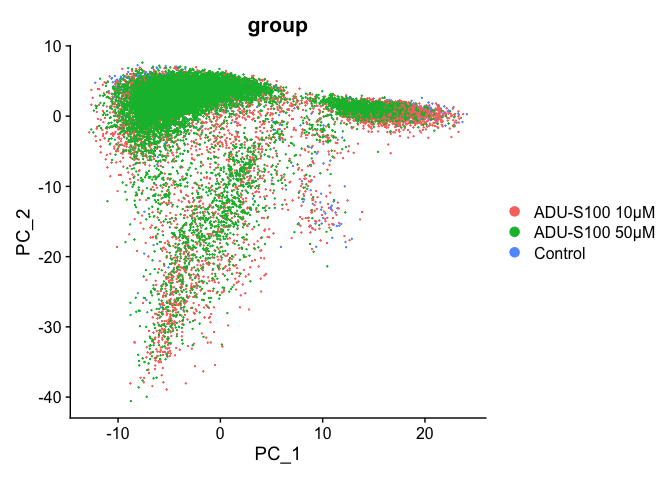<!-- -->

``` r
ggsave(filename="PCA.pdf",plot=pca,path = "../results/2-harmony/")
```

    ## Saving 7 x 5 in image

``` r
library(harmony)
```

    ## Loading required package: Rcpp

``` r
seuratObj <- RunHarmony(sce, "orig.ident")
```

    ## Transposing data matrix

    ## Initializing state using k-means centroids initialization

    ## Harmony 1/10

    ## Harmony 2/10

    ## Harmony 3/10

    ## Harmony converged after 3 iterations

``` r
names(seuratObj@reductions)
```

    ## [1] "pca"     "harmony"

``` r
seuratObj <- RunUMAP(seuratObj,  dims = 1:15, 
                     reduction = "harmony")
```

    ## Warning: The default method for RunUMAP has changed from calling Python UMAP via reticulate to the R-native UWOT using the cosine metric
    ## To use Python UMAP via reticulate, set umap.method to 'umap-learn' and metric to 'correlation'
    ## This message will be shown once per session

    ## 23:51:46 UMAP embedding parameters a = 0.9922 b = 1.112

    ## 23:51:46 Read 20147 rows and found 15 numeric columns

    ## 23:51:46 Using Annoy for neighbor search, n_neighbors = 30

    ## 23:51:46 Building Annoy index with metric = cosine, n_trees = 50

    ## 0%   10   20   30   40   50   60   70   80   90   100%

    ## [----|----|----|----|----|----|----|----|----|----|

    ## **************************************************|
    ## 23:51:49 Writing NN index file to temp file /var/folders/9x/ydh43rq15vv6ksb44l_n9z740000gn/T//RtmpiI95VE/file3f3e9d4a2c4
    ## 23:51:49 Searching Annoy index using 1 thread, search_k = 3000
    ## 23:51:57 Annoy recall = 100%
    ## 23:51:58 Commencing smooth kNN distance calibration using 1 thread with target n_neighbors = 30
    ## 23:51:59 Initializing from normalized Laplacian + noise (using RSpectra)
    ## 23:52:00 Commencing optimization for 200 epochs, with 836660 positive edges
    ## 23:52:13 Optimization finished

``` r
DimPlot(seuratObj,group.by = "group",reduction = "umap" ) 
```

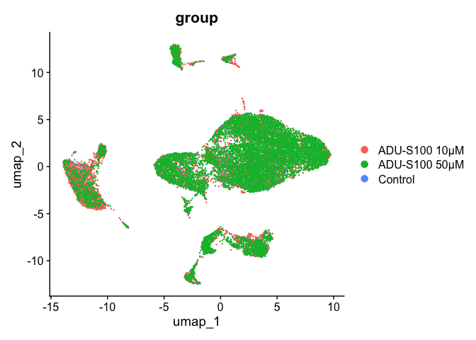<!-- -->

``` r
sce=seuratObj
sce <- FindNeighbors(sce, reduction = "harmony",
                     dims = 1:15) 
```

    ## Computing nearest neighbor graph

    ## Computing SNN

``` r
sce.all=sce
```

``` r
# check different revolutions
for (res in c(0.01, 0.05, 0.1, 0.2, 0.3, 0.5,0.8,1)) {
  sce.all=FindClusters(sce.all, #graph.name = "CCA_snn",
                       resolution = res, algorithm = 1)
}
```

    ## Modularity Optimizer version 1.3.0 by Ludo Waltman and Nees Jan van Eck
    ## 
    ## Number of nodes: 20147
    ## Number of edges: 657258
    ## 
    ## Running Louvain algorithm...
    ## Maximum modularity in 10 random starts: 0.9935
    ## Number of communities: 4
    ## Elapsed time: 5 seconds
    ## Modularity Optimizer version 1.3.0 by Ludo Waltman and Nees Jan van Eck
    ## 
    ## Number of nodes: 20147
    ## Number of edges: 657258
    ## 
    ## Running Louvain algorithm...
    ## Maximum modularity in 10 random starts: 0.9779
    ## Number of communities: 8
    ## Elapsed time: 5 seconds
    ## Modularity Optimizer version 1.3.0 by Ludo Waltman and Nees Jan van Eck
    ## 
    ## Number of nodes: 20147
    ## Number of edges: 657258
    ## 
    ## Running Louvain algorithm...
    ## Maximum modularity in 10 random starts: 0.9624
    ## Number of communities: 9
    ## Elapsed time: 4 seconds
    ## Modularity Optimizer version 1.3.0 by Ludo Waltman and Nees Jan van Eck
    ## 
    ## Number of nodes: 20147
    ## Number of edges: 657258
    ## 
    ## Running Louvain algorithm...
    ## Maximum modularity in 10 random starts: 0.9400
    ## Number of communities: 13
    ## Elapsed time: 5 seconds
    ## Modularity Optimizer version 1.3.0 by Ludo Waltman and Nees Jan van Eck
    ## 
    ## Number of nodes: 20147
    ## Number of edges: 657258
    ## 
    ## Running Louvain algorithm...
    ## Maximum modularity in 10 random starts: 0.9241
    ## Number of communities: 13
    ## Elapsed time: 4 seconds
    ## Modularity Optimizer version 1.3.0 by Ludo Waltman and Nees Jan van Eck
    ## 
    ## Number of nodes: 20147
    ## Number of edges: 657258
    ## 
    ## Running Louvain algorithm...
    ## Maximum modularity in 10 random starts: 0.9005
    ## Number of communities: 16
    ## Elapsed time: 5 seconds
    ## Modularity Optimizer version 1.3.0 by Ludo Waltman and Nees Jan van Eck
    ## 
    ## Number of nodes: 20147
    ## Number of edges: 657258
    ## 
    ## Running Louvain algorithm...
    ## Maximum modularity in 10 random starts: 0.8775
    ## Number of communities: 20
    ## Elapsed time: 4 seconds
    ## Modularity Optimizer version 1.3.0 by Ludo Waltman and Nees Jan van Eck
    ## 
    ## Number of nodes: 20147
    ## Number of edges: 657258
    ## 
    ## Running Louvain algorithm...
    ## Maximum modularity in 10 random starts: 0.8627
    ## Number of communities: 22
    ## Elapsed time: 4 seconds

``` r
colnames(sce.all@meta.data)
```

    ##  [1] "orig.ident"       "nCount_RNA"       "nFeature_RNA"     "percent_mito"    
    ##  [5] "percent_ribo"     "percent_hb"       "group"            "S.Score"         
    ##  [9] "G2M.Score"        "Phase"            "old.ident"        "RNA_snn_res.0.01"
    ## [13] "seurat_clusters"  "RNA_snn_res.0.05" "RNA_snn_res.0.1"  "RNA_snn_res.0.2" 
    ## [17] "RNA_snn_res.0.3"  "RNA_snn_res.0.5"  "RNA_snn_res.0.8"  "RNA_snn_res.1"

``` r
apply(sce.all@meta.data[,grep("RNA_snn",colnames(sce.all@meta.data))],2,table)
```

    ## $RNA_snn_res.0.01
    ## 
    ##     0     1     2     3 
    ## 13997  2935  2288   927 
    ## 
    ## $RNA_snn_res.0.05
    ## 
    ##     0     1     2     3     4     5     6     7 
    ## 11717  2836  2286  1951   653   332   274    98 
    ## 
    ## $RNA_snn_res.0.1
    ## 
    ##     0     1     2     3     4     5     6     7     8 
    ## 11486  2836  2298  1955   653   332   274   215    98 
    ## 
    ## $RNA_snn_res.0.2
    ## 
    ##    0    1   10   11   12    2    3    4    5    6    7    8    9 
    ## 7122 2902  274  216   98 2508 2303 1450 1387  654  574  332  327 
    ## 
    ## $RNA_snn_res.0.3
    ## 
    ##    0    1   10   11   12    2    3    4    5    6    7    8    9 
    ## 6032 3150  274  217   98 2505 2329 2264 1432  654  529  333  330 
    ## 
    ## $RNA_snn_res.0.5
    ## 
    ##    0    1   10   11   12   13   14   15    2    3    4    5    6    7    8    9 
    ## 3373 3133  333  306  274  216   98   77 2614 2529 2358 1451 1384  846  578  577 
    ## 
    ## $RNA_snn_res.0.8
    ## 
    ##    0    1   10   11   12   13   14   15   16   17   18   19    2    3    4    5 
    ## 2864 2706  852  805  577  332  330  274  261  220   98   77 2332 1499 1461 1291 
    ##    6    7    8    9 
    ## 1249 1018 1006  895 
    ## 
    ## $RNA_snn_res.1
    ## 
    ##    0    1   10   11   12   13   14   15   16   17   18   19    2   20   21    3 
    ## 2055 1862  899  895  577  573  332  330  281  274  219  213 1765   98   77 1707 
    ##    4    5    6    7    8    9 
    ## 1566 1494 1470 1357 1092 1011

``` r
p1_dim_low=plot_grid(ncol = 3, DimPlot(sce.all, reduction = "umap", group.by = "RNA_snn_res.0.01") +
                   ggtitle("louvain_0.01"), DimPlot(sce.all, reduction = "umap", group.by = "RNA_snn_res.0.1") +
                   ggtitle("louvain_0.1"), DimPlot(sce.all, reduction = "umap", group.by = "RNA_snn_res.0.2") +
                   ggtitle("louvain_0.2"))
ggsave(plot=p1_dim_low, filename="Dimplot_diff_resolution_low.pdf",width = 14, path = "../results/2-harmony/")
```

    ## Saving 14 x 5 in image

``` r
p1_dim_high=plot_grid(ncol = 3, DimPlot(sce.all, reduction = "umap", group.by = "RNA_snn_res.0.8") +
                   ggtitle("louvain_0.8"), DimPlot(sce.all, reduction = "umap", group.by = "RNA_snn_res.1") +
                   ggtitle("louvain_1"), DimPlot(sce.all, reduction = "umap", group.by = "RNA_snn_res.0.3") +
                   ggtitle("louvain_0.3"))
ggsave(plot=p1_dim_high, filename="Dimplot_diff_resolution_high.pdf",width = 18,path ="../results/2-harmony/" )
```

    ## Saving 18 x 5 in image

``` r
# cluster tree
p2_tree=clustree(sce.all@meta.data, prefix = "RNA_snn_res."); p2_tree
```

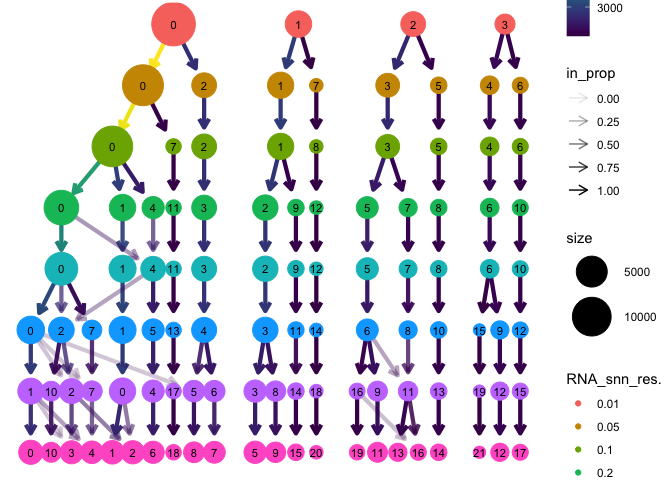<!-- -->

``` r
ggsave(plot=p2_tree, filename="Tree_diff_resolution.pdf", path ="../results/2-harmony/")
```

    ## Saving 7 x 5 in image

Pick resolution = 0.8

``` r
sel.clust = "RNA_snn_res.0.8"
sce.all <- SetIdent(sce.all, value = sel.clust)
table(sce.all@active.ident) 
```

    ## 
    ##    0    1    2    3    4    5    6    7    8    9   10   11   12   13   14   15 
    ## 2864 2706 2332 1499 1461 1291 1249 1018 1006  895  852  805  577  332  330  274 
    ##   16   17   18   19 
    ##  261  220   98   77

``` r
dir.create("../results/3-Clustering")
```

    ## Warning in dir.create("../results/3-Clustering"): '../results/3-Clustering'
    ## already exists

``` r
DimPlot(sce.all, reduction = "umap", group.by = "RNA_snn_res.0.8",label = T) 
```

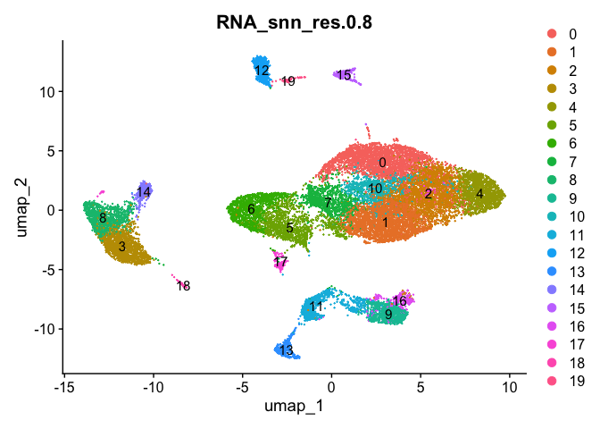<!-- -->

``` r
ggsave('umap_by_RNA_snn_res.0.8.pdf',width = 7,height = 6, path = "../results/3-Clustering/")

# group
DimPlot(sce.all, reduction = "umap",split.by = 'group',
        group.by = "RNA_snn_res.0.8",label = T) 
```

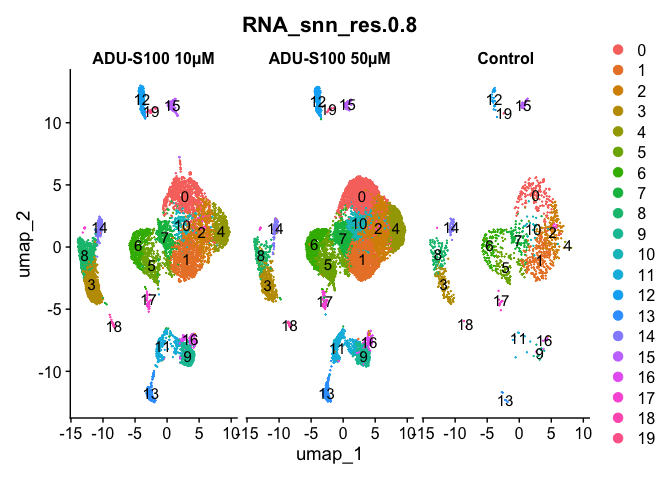<!-- -->

``` r
ggsave('group_umap.pdf',width = 15,height = 6, path = "../results/3-Clustering/")
```

In Seurat V5, there are no features information in
assays_RNA_layers_counts, try to add row names and cells for counts
data:

``` r
genes <- sce.all[["RNA"]]@features %>%
  rownames()
rownames(sce.all@assays$RNA@layers$counts) <- genes

cells <- sce.all[["RNA"]]@cells %>%
  rownames()
colnames(sce.all@assays$RNA@layers$counts) <- cells
```

Check common markers

``` r
genes_to_check = c('PTPRC', 'CD3D', 'CD3E', 'CD4','CD8A','CD19', 'CD79A', 'MS4A1' ,
                   'IGHG1', 'MZB1', 'SDC1',
                   'CD68', 'CD163', 'CD14',
                   'TPSAB1' , 'TPSB2',  # mast cells,
                   'MKI67','TOP2A','KLRC1',
                   'RCVRN','FPR1' , 'ITGAM' ,
                   'FGF7','MME', 'ACTA2',
                   'PECAM1', 'VWF',
                   'KLRB1','NCR1', # NK
                   'EPCAM' , 'KRT19', 'ALDH1A1',
                   'MKI67' ,'TOP2A' )
genes_to_check=str_to_upper(unique(genes_to_check))
p_all_markers <- DotPlot(sce.all, features = genes_to_check,
                         assay='RNA' )  + coord_flip()
p_all_markers
```

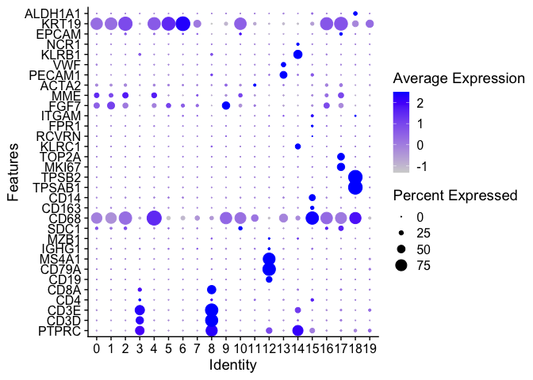<!-- -->

``` r
ggsave('check_all_markers.pdf',height = 10, path = "../results/3-Clustering/")
```

    ## Saving 7 x 10 in image

Check T cell markers

``` r
genes_to_check = c('PTPRC', 'CD3D', 'CD3E', 'CD4','CD8A',
                   'CCR7', 'SELL' , 'TCF7','CXCR6' , 'ITGA1',
                   'FOXP3', 'IL2RA',  'CTLA4','GZMB', 'GZMK','CCL5',
                   'IFNG', 'CCL4', 'CCL3' ,
                   'PRF1' , 'NKG7') 
genes_to_check=str_to_upper(unique(genes_to_check))
DotPlot(sce.all, features = genes_to_check,
                         assay='RNA' )  + coord_flip()
```

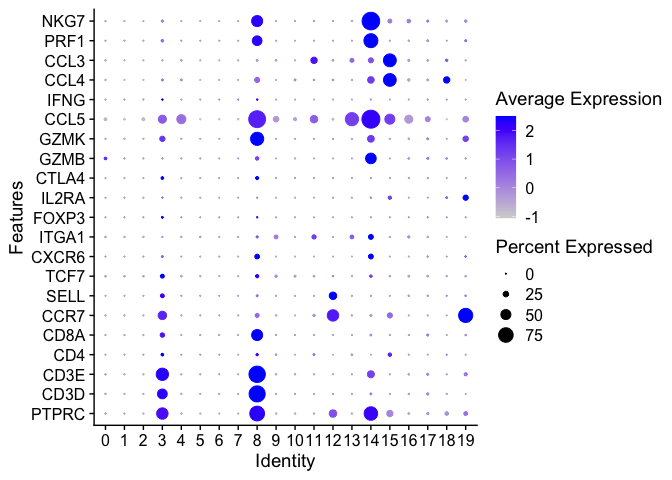<!-- -->

``` r
ggsave('check_T_cell_markers.pdf',height = 8, path = "../results/3-Clustering/")
```

    ## Saving 7 x 8 in image

Check B cells:

``` r
# mast cells, TPSAB1 and TPSB2 
# B cell,  CD79A  and MS4A1 (CD20) 
# naive B cells, such as MS4A1 (CD20), CD19, CD22, TCL1A, and CD83, 
# plasma B cells, such as CD38, TNFRSF17 (BCMA), and IGHG1/IGHG4
genes_to_check = c('CD3D','MS4A1','CD79A',
                   'CD19', 'CD22', 'TCL1A',  'CD83', #  naive B cells
                   'CD38','TNFRSF17','IGHG1','IGHG4', # plasma B cells,
                   'TPSAB1' , 'TPSB2',  # mast cells,
                   'PTPRC' ) 
genes_to_check=str_to_upper(unique(genes_to_check))
DotPlot(sce.all, features = genes_to_check,
                         assay='RNA' )  + coord_flip()
```

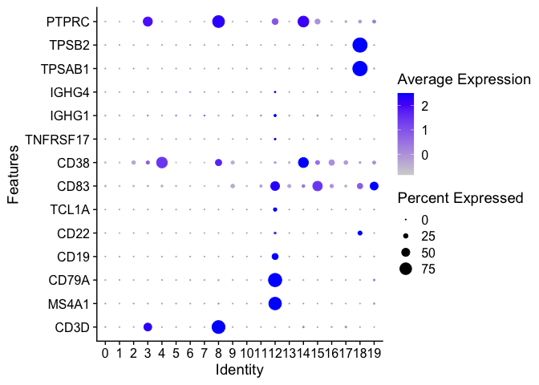<!-- -->

``` r
ggsave('check_B_cell_markers.pdf',height = 8, path = "../results/3-Clustering/")
```

    ## Saving 7 x 8 in image

Check Myeloid markers:

``` r
genes_to_check = c('CD68', 'CD163', 'CD14',  'CD86','C1QA',  'C1QB',  # mac
                   'S100A9', 'S100A8', 'MMP19',# monocyte
                   'LAMP3', 'IDO1','IDO2',## DC3 
                   'MRC1','MSR1','ITGAE','ITGAM','ITGAX','SIGLEC7', 
                   'CD1E','CD1C', # DC2
                   'XCR1','CLEC9A','FCER1A',# DC1
                   'GZMB','TCF4','IRF7')
genes_to_check=str_to_upper(unique(genes_to_check))
DotPlot(sce.all, features = genes_to_check,
                         assay='RNA' )  + coord_flip()
```

    ## Warning: The following requested variables were not found: CD1E, CLEC9A, FCER1A

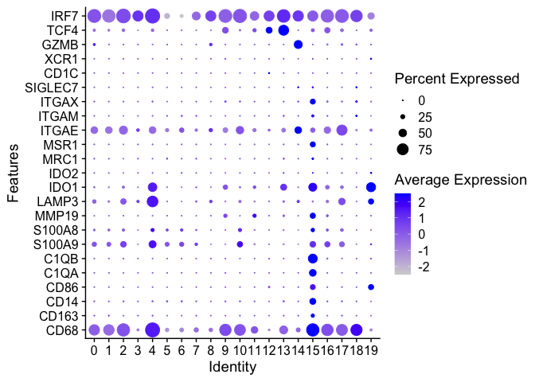<!-- -->

``` r
ggsave('check_Myeloid_markers.pdf',height = 10, path = "../results/3-Clustering/")
```

    ## Saving 7 x 10 in image

Check Epithelial markers:

``` r
# epi or tumor (EPCAM, KRT19, PROM1, ALDH1A1, CD24).
# - alveolar type I cell (AT1; AGER+)
# - alveolar type II cell (AT2; SFTPA1)
# - secretory club cell (Club; SCGB1A1+)
# - basal airway epithelial cells (Basal; KRT17+)
# - ciliated airway epithelial cells (Ciliated; TPPP3+) 
genes_to_check = c(  'EPCAM' , 'KRT19', 'PROM1', 'ALDH1A1' ,
                     'AGER','SFTPA1','SCGB1A1','KRT17','TPPP3',
                     'KRT4','KRT14','KRT8','KRT18',
                     'CD3D','PTPRC' ) 
genes_to_check=str_to_upper(unique(genes_to_check))
DotPlot(sce.all, features = genes_to_check,
                         assay='RNA' )  + coord_flip()
```

    ## Warning: The following requested variables were not found: PROM1, SCGB1A1

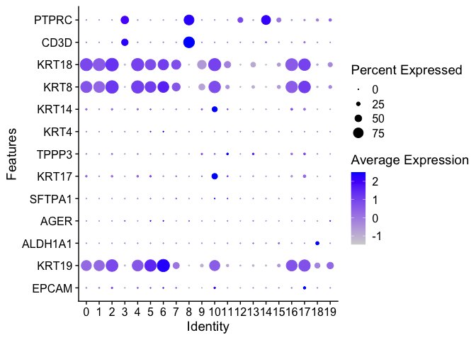<!-- -->

``` r
ggsave('check_epi_markers.pdf',height = 8, path = "../results/3-Clustering/")
```

    ## Saving 7 x 8 in image

Check Stromal markers:

``` r
genes_to_check = c('TEK',"PTPRC","EPCAM","PDPN","PECAM1",'PDGFRB',
                   'CSPG4','GJB2', 'RGS5','ITGA7',
                   'ACTA2','RBP1','CD36', 'ADGRE5','COL11A1','FGF7', 'MME')
genes_to_check=str_to_upper(unique(genes_to_check))
DotPlot(sce.all, features = genes_to_check,
                         assay='RNA' )  + coord_flip()
```

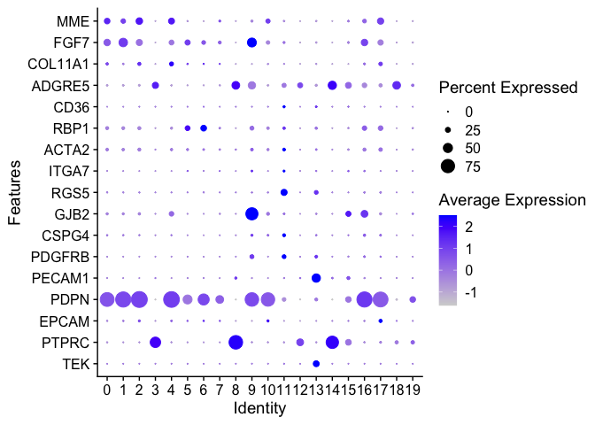<!-- -->

``` r
ggsave('check_stromal_markers.pdf',height = 8, path = "../results/3-Clustering/")
```

    ## Saving 7 x 8 in image

Check markers in paper:

``` r
genes_to_check = c('COL1A2',"LUM","DCN","VWF","CLDN5",'CDH5',
                   'TOP2A','MIK167', 'IGKC','MZB1',
                   'JCHAIN','CPA3','TPSAB1', 'C1QA','MIRC1','CD68', 'LYZ',
                   'CD3G','CD3E','CD3D', 'CD79B','CD79A','MS4A1', 'CLEC10AF',
                   'SCCER1A','SCGB3A1','GB1A1', 'PIFO','TPPP3','NIKX2-1', 'NAPSA',"EPCAM","SFTPC","SFTPB")
genes_to_check=str_to_upper(unique(genes_to_check))
p_paper_markers <- DotPlot(sce.all, features = genes_to_check,
                         assay='RNA' )  + coord_flip()
```

    ## Warning: The following requested variables were not found: MIK167, MIRC1,
    ## CLEC10AF, SCCER1A, GB1A1, NIKX2-1

``` r
p_paper_markers
```

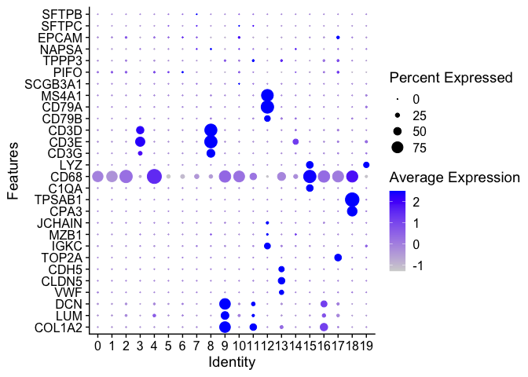<!-- -->

``` r
ggsave('check_paper_markers.pdf',height = 8, path = "../results/3-Clustering/")
```

    ## Saving 7 x 8 in image

``` r
p_umap=DimPlot(sce.all, reduction = "umap",
               group.by = "RNA_snn_res.0.8",label = T) 

p_all_markers+p_umap
```

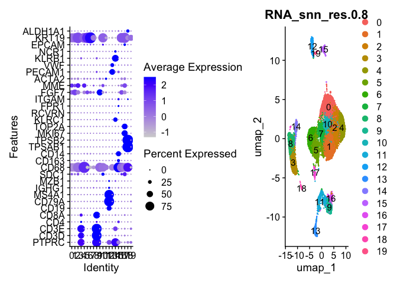<!-- -->

``` r
ggsave('all_markers_uma.pdf',width = 13,height = 8, path = "../results/3-Clustering/")
```

``` r
p_paper_markers+p_umap
```

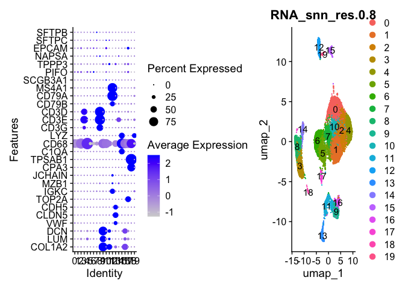<!-- -->

``` r
ggsave('paper_markers_uma.pdf',width = 13,height = 8, path = "../results/3-Clustering/")
```

``` r
DimPlot(sce.all, reduction = "umap",split.by = 'group',
        group.by = "RNA_snn_res.0.8",label = T) 
```

<!-- -->

``` r
ggsave('group_umap.pdf',width = 15,height = 6, path = "../results/3-Clustering/")
```

``` r
DimPlot(sce.all, reduction = "umap",split.by = 'seurat_clusters',
        group.by = "RNA_snn_res.0.8",label = T) 
```

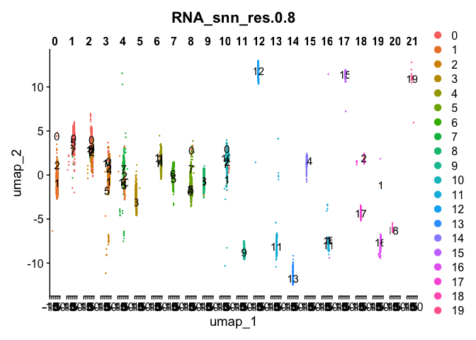<!-- -->

``` r
ggsave('cluster_umap.pdf',width = 30, path = "../results/3-Clustering/")
```

    ## Saving 30 x 5 in image

``` r
sce.all  
```

    ## An object of class Seurat 
    ## 22959 features across 20147 samples within 1 assay 
    ## Active assay: RNA (22959 features, 2000 variable features)
    ##  3 layers present: counts, data, scale.data
    ##  3 dimensional reductions calculated: pca, harmony, umap

``` r
sce=sce.all
table(Idents(sce))  
```

    ## 
    ##    0    1    2    3    4    5    6    7    8    9   10   11   12   13   14   15 
    ## 2864 2706 2332 1499 1461 1291 1249 1018 1006  895  852  805  577  332  330  274 
    ##   16   17   18   19 
    ##  261  220   98   77

``` r
sce.markers <- FindAllMarkers(object = sce, only.pos = TRUE, min.pct = 0.25, 
                              thresh.use = 0.25)
```

    ## Calculating cluster 0

    ## Calculating cluster 1

    ## Calculating cluster 2

    ## Calculating cluster 3

    ## Calculating cluster 4

    ## Calculating cluster 5

    ## Calculating cluster 6

    ## Calculating cluster 7

    ## Calculating cluster 8

    ## Calculating cluster 9

    ## Calculating cluster 10

    ## Calculating cluster 11

    ## Calculating cluster 12

    ## Calculating cluster 13

    ## Calculating cluster 14

    ## Calculating cluster 15

    ## Calculating cluster 16

    ## Calculating cluster 17

    ## Calculating cluster 18

    ## Calculating cluster 19

``` r
# Data set too big
#DT::datatable(sce.markers)
```

``` r
res='RNA_snn_res.0.8'
write.csv(sce.markers,file=paste0('../results/3-Clustering/',res,'_sce.markers.csv'))
```

``` r
# Top3 heatmap
top10 <- sce.markers %>% group_by(cluster) %>% top_n(10, avg_log2FC)
top3 <- sce.markers %>% group_by(cluster) %>% top_n(3, avg_log2FC)
DoHeatmap(sce,top3$gene)
```

    ## Warning in DoHeatmap(sce, top3$gene): The following features were omitted as
    ## they were not found in the scale.data slot for the RNA assay: XIST, UGDH, MST1,
    ## TTC39A, TRAT1, CD6

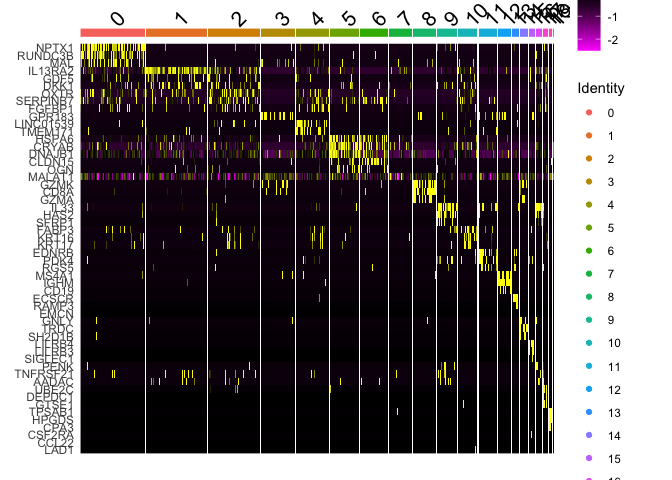<!-- -->

``` r
ggsave(paste0(res,'_DoHeatmap_check_top3_markers_by_clusters.pdf'), path = "../results/3-Clustering/")
```

    ## Saving 7 x 5 in image

``` r
DotPlot(sce, features = unique(top3$gene),
             assay='RNA'  )  + coord_flip()
```

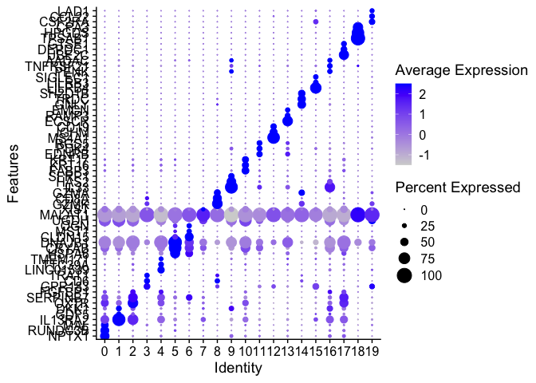<!-- -->

``` r
ggsave(paste0(res,'_DotPlot_check_top3_markers_by_clusters.pdf'),
       height = 15,width = 10, path = "../results/3-Clustering/")
```

``` r
#DotPlot(sce, features = unique(top10$gene),
#            assay='RNA'  )  + coord_flip()
#ggsave(paste0(res,'_DotPlot_check_top10_markers_by_clusters.pdf'),
#       height = 25,width = 10, path = "../results/3-Clustering/")
```

``` r
dir.create("../results/3-celltype")
```

    ## Warning in dir.create("../results/3-celltype"): '../results/3-celltype' already
    ## exists

``` r
genes <- c("Cd3d","Trbc2","Prtn3","Lmo2","Sox4","Ctla2a","Cd34",
           "Idh2","Cdk6","BC035044","Phgdh","Ms4a3","Ctsg","Igfbp4",
           "Cst7","Prss57","Cd9","AW112010","Klrd1","Klrk1","Gzma",
           "Klre1","Fn1","Ccl9","Ctss","Ms4a6c","S100a4","Tcf4","Ccr9",
           "Cd7","Cox6a2","Siglech","Mzb1","Chchd10","Vpreb3","H2-Aa","Cd79a",
           "H2-Eb1","Ebf1","Iglc2")
genes=str_to_upper(genes)
paper_markers =DotPlot(sce, assay = "RNA", features = genes,group.by = "RNA_snn_res.0.8" ) +
  coord_flip()
```

    ## Warning: The following requested variables were not found: CTLA2A, BC035044,
    ## AW112010, KLRE1, CCL9, MS4A6C, SIGLECH, H2-AA, H2-EB1

``` r
  theme(axis.text.x = element_text(angle = 45, 
                                   vjust = 0.5, hjust=0.5))
```

    ## List of 1
    ##  $ axis.text.x:List of 11
    ##   ..$ family       : NULL
    ##   ..$ face         : NULL
    ##   ..$ colour       : NULL
    ##   ..$ size         : NULL
    ##   ..$ hjust        : num 0.5
    ##   ..$ vjust        : num 0.5
    ##   ..$ angle        : num 45
    ##   ..$ lineheight   : NULL
    ##   ..$ margin       : NULL
    ##   ..$ debug        : NULL
    ##   ..$ inherit.blank: logi FALSE
    ##   ..- attr(*, "class")= chr [1:2] "element_text" "element"
    ##  - attr(*, "class")= chr [1:2] "theme" "gg"
    ##  - attr(*, "complete")= logi FALSE
    ##  - attr(*, "validate")= logi TRUE

``` r
paper_markers
```

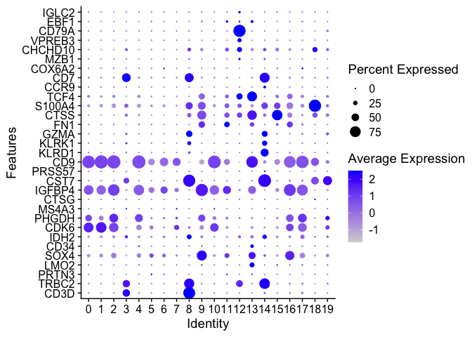<!-- -->

``` r
ps <- plot_grid(paper_markers,p_umap,rel_widths = c(1.5,1))
ps
```

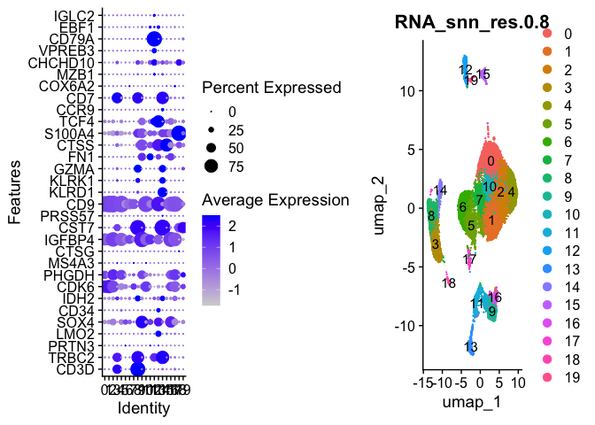<!-- -->

``` r
ggsave(ps,filename =  'umap_paper_marker_markers.pdf'
       ,units = "cm",width = 60,height = 22, path = "../results/3-celltype/")
```

Plot for Myeloid cells(Mac,pDC,DC1,DC2,DC3,Mono)

``` r
Mac=c("CD14", "CD163", "APOE", "C1QA", "C1QB", "C1QC")
pDC=c("LILRA4", "IL3RA","TCF4","TCL1A","CLEC4C")
DC1=c("CLEC9A", "XCR1", "BATF3")  
DC2=c("CD1A", "FCER1A", "CD1C","CD1E","CLEC10A")
DC3=c("CCR7", "LAMP3", "FSCN1","CCL22","BIRC3")
Mono=c("VCVN", "FCN1", "S100A12", "S100A8", "S100A9",'FCGR3A')
genes_to_check =list(
  Mac=Mac,
  pDC=pDC,
  DC1=DC1, 
  DC2=DC2,
  DC3=DC3 ,
  Mono=Mono
)
genes_to_check = lapply(genes_to_check, str_to_upper)
p_all_markers=DotPlot(sce.all , 
                      features = genes_to_check,
                      scale = T,assay='RNA' )+
  theme(axis.text.x=element_text(angle=45,hjust = 1))
```

    ## Warning: The following requested variables were not found: CLEC4C, CLEC9A,
    ## FCER1A, CD1E, VCVN

    ## Warning: The `facets` argument of `facet_grid()` is deprecated as of ggplot2 2.2.0.
    ## ℹ Please use the `rows` argument instead.
    ## ℹ The deprecated feature was likely used in the Seurat package.
    ##   Please report the issue at <https://github.com/satijalab/seurat/issues>.
    ## This warning is displayed once every 8 hours.
    ## Call `lifecycle::last_lifecycle_warnings()` to see where this warning was
    ## generated.

``` r
p_all_markers
```

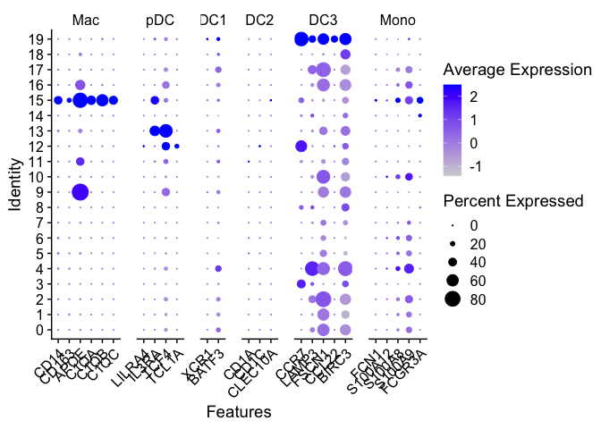<!-- -->

``` r
ggsave('check_myeloids_markers.pdf',height = 11,width = 11, path = "../results/3-celltype/")
```

Annotation:

``` r
# Check MSLN tumor
genes_to_check = c("CXCL9","CXCL10","CXCL11","MSLN")
genes_to_check=str_to_upper(unique(genes_to_check))
DotPlot(sce.all, features = genes_to_check,
                         assay='RNA' )  + coord_flip()
```

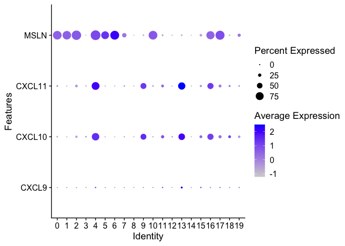<!-- -->

``` r
ggsave('check_MSLN_markers.pdf', path = "../results/3-Clustering/")
```

    ## Saving 7 x 5 in image

``` r
# Check fibo tumor
genes_to_check = c("FGF7","MME","ACTA2",
                   "DCN", "LUM","GSN")
genes_to_check=str_to_upper(unique(genes_to_check))
DotPlot(sce.all, features = genes_to_check,
                         assay='RNA' )  + coord_flip()
```

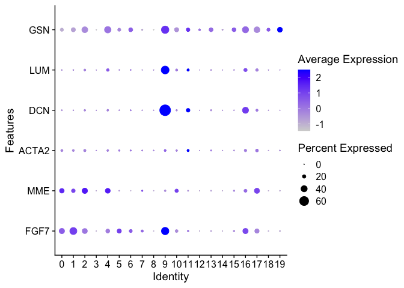<!-- -->

``` r
ggsave('check_fibo_markers.pdf', path = "../results/3-Clustering/")
```

    ## Saving 7 x 5 in image

``` r
celltype=data.frame(ClusterID=0:19,
                    celltype= 0:19)

celltype[celltype$ClusterID %in% c( 3,8,14 ),2]='NK T cell'  
celltype[celltype$ClusterID %in% c( 17),2]='cycling'   
celltype[celltype$ClusterID %in% c( 12),2]='B' 
celltype[celltype$ClusterID %in% c( 18),2]='mast'  
celltype[celltype$ClusterID %in% c(0,1,2,4,5,6,7,10),2]='MSLN Tumor'  
celltype[celltype$ClusterID %in% c(9,11,16),2]='fibo'  
celltype[celltype$ClusterID %in% c(15),2]='mac'
celltype[celltype$ClusterID %in% c( 13),2]='pDC' 
celltype[celltype$ClusterID %in% c( 19),2]='DC3'

head(celltype)
```

    ##   ClusterID   celltype
    ## 1         0 MSLN Tumor
    ## 2         1 MSLN Tumor
    ## 3         2 MSLN Tumor
    ## 4         3  NK T cell
    ## 5         4 MSLN Tumor
    ## 6         5 MSLN Tumor

``` r
sce.all@meta.data$celltype = "NA"
for(i in 1:nrow(celltype)){
  sce.all@meta.data[which(sce.all@meta.data$RNA_snn_res.0.8 == celltype$ClusterID[i]),'celltype'] <- celltype$celltype[i]}
table(sce.all@meta.data$celltype)
```

    ## 
    ##          B    cycling        DC3       fibo        mac       mast MSLN Tumor 
    ##        577        220         77       1961        274         98      13773 
    ##  NK T cell        pDC 
    ##       2835        332

Check in umap

``` r
umap_celltype <- DimPlot(sce.all, reduction = "umap", group.by = "celltype",label = T)
umap_celltype
```

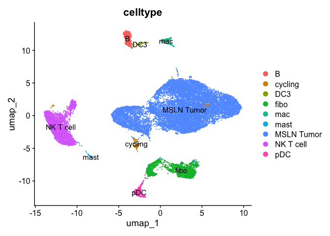<!-- -->

``` r
ggsave('umap_celltype.pdf', path = "../results/3-celltype/")
```

    ## Saving 7 x 5 in image

Check clusters in lower resolution.

``` r
table(sce.all@meta.data$celltype,sce.all@meta.data$RNA_snn_res.0.01)
```

    ##             
    ##                  0     1     2     3
    ##   B              0     1     0   576
    ##   cycling      220     0     0     0
    ##   DC3            0     0     0    77
    ##   fibo           7     0  1954     0
    ##   mac            0     0     0   274
    ##   mast           0    98     0     0
    ##   MSLN Tumor 13770     1     2     0
    ##   NK T cell      0  2835     0     0
    ##   pDC            0     0   332     0

``` r
genes_to_check = c('PTPRC', 'CD3D', 'CD3E', 'CD4','CD8A',
                   'CD19', 'CD79A', 'MS4A1' ,
                   'IGHG1', 'MZB1', 'SDC1',
                   'CD68', 'CD163', 'CD14', 
                   'TPSAB1' , 'TPSB2',  # mast cells,
                   'RCVRN','FPR1' , 'ITGAM' ,
                   'C1QA',  'C1QB',  # mac
                   'S100A9', 'S100A8', 'MMP19',# monocyte
                   'FCGR3A',
                   'LAMP3', 'IDO1','IDO2',## DC3 
                   'CD1E','CD1C', # DC2
                   'KLRB1','NCR1', # NK 
                   'FGF7','MME', 'ACTA2', ## human  fibo 
                   'DCN', 'LUM',  'GSN' , ## mouse PDAC fibo 
                   'MKI67' , 'TOP2A', 
                   'PECAM1', 'VWF',  ## endo 
                   'EPCAM' , 'KRT19','KRT7', # epi 
                   'FYXD2', 'TM4SF4', 'ANXA4',# cholangiocytes
                   'APOC3', 'FABP1',  'APOA1',  # hepatocytes
                   'Serpina1c','PROM1', 'ALDH1A1',
                   "NKG7",#NKT
                   "CXCL9", "CXCL10", "CXCL11","MSLN")
p_all_markers=DotPlot(sce.all, features = genes_to_check,
                      assay='RNA' ,group.by = 'celltype' )  + coord_flip()+
  theme(axis.text.x = element_text(angle = 45, 
                                    vjust = 0.5, hjust=0.5)) 
```

    ## Warning: The following requested variables were not found: CD1E, FYXD2, APOC3,
    ## FABP1, Serpina1c, PROM1

``` r
p_all_markers+umap_celltype
```

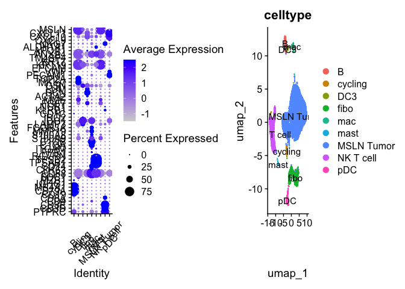<!-- -->

``` r
ggsave('all_markers_umap_by_celltype.pdf',width = 15,height = 10, path = "../results/3-celltype/")

p_harmony=DimPlot(sce.all, reduction = "harmony", group.by = "celltype",label = T)
p_all_markers+p_harmony
```

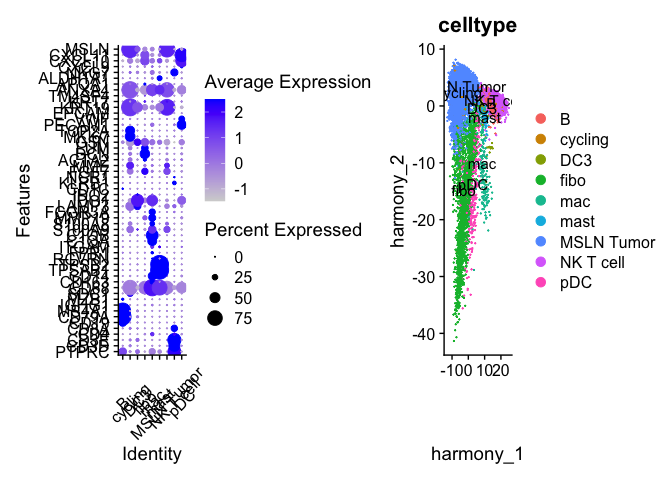<!-- -->

``` r
ggsave('all_markers_umap_by_harmony.pdf',width = 15,height = 10, path = "../results/3-celltype/")
```

Check T-sne

``` r
sce.all=RunTSNE(sce.all,  dims = 1:15, 
        reduction = "harmony")
p_tsne=DimPlot(sce.all, reduction = "tsne", group.by = "celltype",label = T)
p_all_markers+p_tsne
```

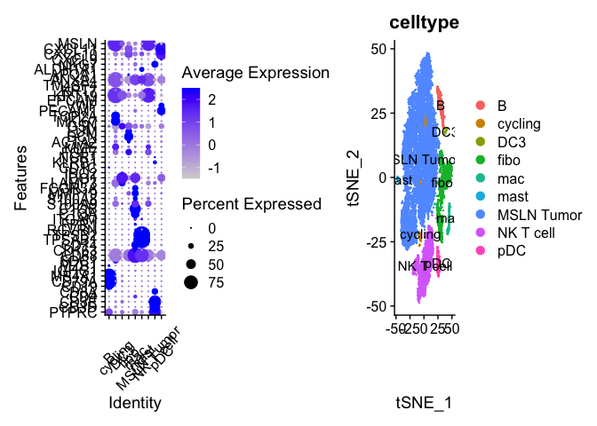<!-- -->

``` r
ggsave('all_markers_umap_by_tsne.pdf',width = 15,height = 10, path = "../results/3-celltype/")
```

Check MSLN Tumor marker genes expression

``` r
features = c('CXCL9',"CXCL10","CXCL11","MSLN")
FeaturePlot(sce.all,features = features )
```

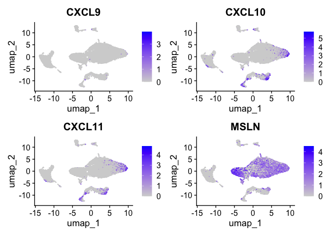<!-- -->

Calculate average expression

``` r
av <-AverageExpression(sce.all,
                      group.by = "celltype",
                       assays = "RNA") 
```

    ## As of Seurat v5, we recommend using AggregateExpression to perform pseudo-bulk analysis.
    ## This message is displayed once per session.

``` r
av=av[[1]]
head(av)
```

    ## 6 x 9 sparse Matrix of class "dgCMatrix"
    ##                      B      cycling       DC3         fibo          mac
    ## AL627309.1 .           .            .         0.0027859819 0.0006323218
    ## AL627309.5 0.004020186 0.0005952898 .         0.0018679469 .           
    ## LINC01409  0.009314565 0.0018524144 .         0.0004317168 0.0050652566
    ## FAM87B     .           0.0051210619 .         0.0125195907 .           
    ## LINC01128  0.148543177 0.1055858927 0.1166517 0.1713455086 0.1910507534
    ## LINC00115  0.043146370 0.0034410867 .         0.0122102850 0.0122647121
    ##                  mast   MSLN Tumor   NK T cell         pDC
    ## AL627309.1 .          0.0007889042 0.001475256 .          
    ## AL627309.5 0.02681756 0.0023935788 .           .          
    ## LINC01409  .          0.0040412128 0.004973704 0.001115821
    ## FAM87B     .          0.0002514217 .           .          
    ## LINC01128  0.11492381 0.1845903356 0.124010921 0.086493742
    ## LINC00115  0.10095164 0.0143228839 0.035818817 0.004062217

``` r
write.csv(av,file = '../results/3-celltype/AverageExpression-0.8.csv')
```

Try more visualization

``` r
color = c(pal_d3("category20")(20),
          pal_d3("category20b")(20),
          pal_d3("category20c")(20),
          pal_d3("category10")(10))

DimPlot(sce.all, reduction = "umap", group.by = "celltype",
        cols = color,
        pt.size = 1.5,
        label = T
) 
```

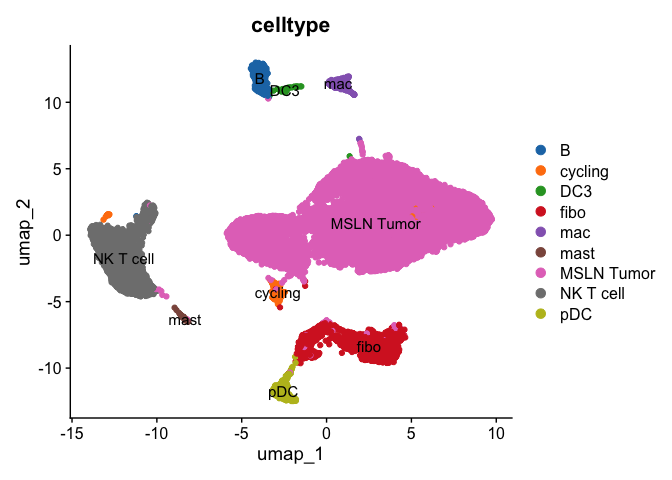<!-- -->

``` r
ggsave('../results/3-celltype/celltype-umap_2.pdf',height = 6,width = 8) 
```

``` r
DimPlot(sce.all, reduction = "umap",
        split.by = "group",
        group.by = "celltype",label = T)
```

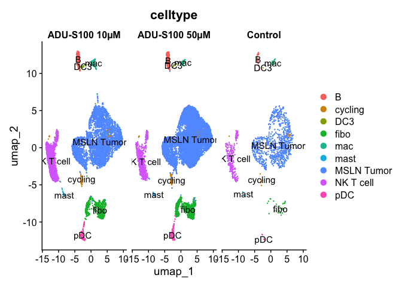<!-- -->

``` r
ggsave(filename="celltype_per_orig.ident.pdf",width = 15, path = "../results/3-celltype/" )
```

    ## Saving 15 x 5 in image

Visualize the group proportion in cell types

``` r
dir.create("../results/4-group")
```

    ## Warning in dir.create("../results/4-group"): '../results/4-group' already
    ## exists

``` r
tb <- table(sce.all$celltype,
            sce.all$group)

# balloonplot
tb_df <- as.data.frame(as.table(tb))
p_balloon <- ggballoonplot(tb_df, x = "Var2", y = "Var1", size = "Freq", fill = "Freq")
p_balloon
```

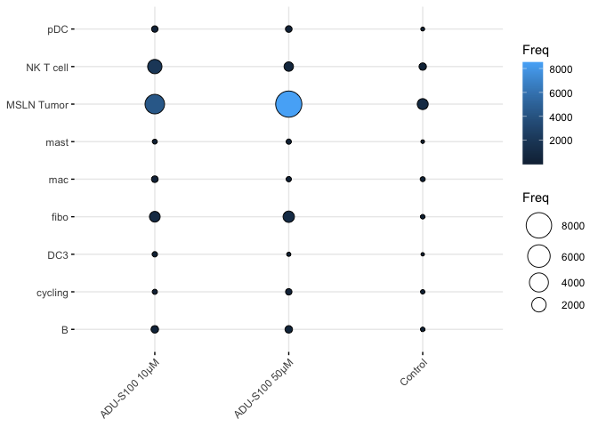<!-- -->

``` r
ggsave("../results/4-group/balloonplot.pdf", plot = p_balloon)
```

    ## Saving 7 x 5 in image

``` r
bar_per <- tb_df %>% 
  group_by(Var1) %>%
  mutate(sum(Freq)) %>%
  mutate(percent = Freq / `sum(Freq)`)
head(bar_per) 
```

    ## # A tibble: 6 × 5
    ## # Groups:   Var1 [6]
    ##   Var1    Var2           Freq `sum(Freq)` percent
    ##   <fct>   <fct>         <int>       <int>   <dbl>
    ## 1 B       ADU-S100 10µM   278         577   0.482
    ## 2 cycling ADU-S100 10µM    52         220   0.236
    ## 3 DC3     ADU-S100 10µM    65          77   0.844
    ## 4 fibo    ADU-S100 10µM   887        1961   0.452
    ## 5 mac     ADU-S100 10µM   172         274   0.628
    ## 6 mast    ADU-S100 10µM    38          98   0.388

``` r
write.csv(bar_per,file = "../results/4-group/celltype_by_group_percent.csv")
```

``` r
ggplot(bar_per, aes(x = Var1, y = percent)) +
  geom_bar(aes(fill = Var2) , stat = "identity") + coord_flip() +
  theme(axis.ticks = element_line(linetype = "blank"),
        legend.position = "top",
        panel.grid.minor = element_line(colour = NA,linetype = "blank"), 
        panel.background = element_rect(fill = NA),
        plot.background = element_rect(colour = NA)) +
  labs(y = "% Relative cell source", fill = NULL)+labs(x = NULL)+
  scale_fill_d3()
```

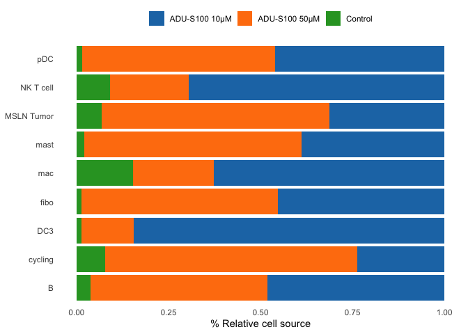<!-- -->

``` r
ggsave("../results/4-group/celltype_by_group_percent.pdf",
      width = 8,height = 4)
```

``` r
# plot in the opposite way
bar_per_2 <- tb_df %>% 
  group_by(Var2) %>%
  mutate(sum(Freq)) %>%
  mutate(percent = Freq / `sum(Freq)`)
head(bar_per_2) 
```

    ## # A tibble: 6 × 5
    ## # Groups:   Var2 [1]
    ##   Var1    Var2           Freq `sum(Freq)` percent
    ##   <fct>   <fct>         <int>       <int>   <dbl>
    ## 1 B       ADU-S100 10µM   278        7915 0.0351 
    ## 2 cycling ADU-S100 10µM    52        7915 0.00657
    ## 3 DC3     ADU-S100 10µM    65        7915 0.00821
    ## 4 fibo    ADU-S100 10µM   887        7915 0.112  
    ## 5 mac     ADU-S100 10µM   172        7915 0.0217 
    ## 6 mast    ADU-S100 10µM    38        7915 0.00480

``` r
ggplot(bar_per_2, aes(x = Var2, y = percent)) +
  geom_bar(aes(fill = Var1) , stat = "identity") + coord_flip() +
  theme(axis.ticks = element_line(linetype = "blank"),
        legend.position = "top",
        panel.grid.minor = element_line(colour = NA,linetype = "blank"), 
        panel.background = element_rect(fill = NA),
        plot.background = element_rect(colour = NA)) +
  labs(y = "% Relative group", fill = NULL)+labs(x = NULL)+
  scale_fill_d3()
```

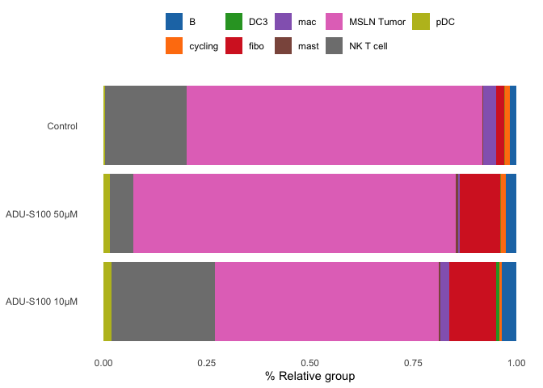<!-- -->
